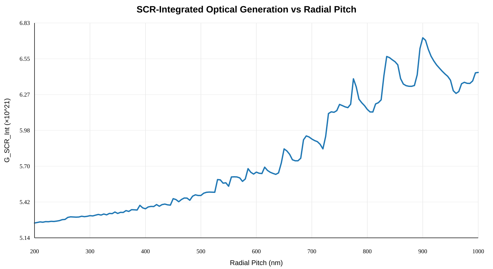
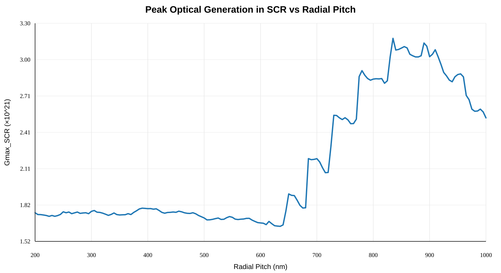
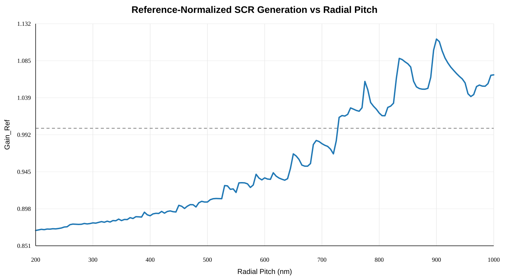

# CMP SPAD A — 2D Annular FF=15% Radial-Pitch DOE Analysis

**실제 분석일:** 2026-09-28  
**기록일:** 2026-09-30  
**작성자:** jujushmaterial  
**연구 단계:** 2D EMW radial-pitch screening 결과 분석 / 3D 검증 전  
**상태:** In Progress

## 1. 분석 목적

2026-09-17에 구성한 A의 annular FF=15% radial-pitch 2D EMW DOE 160 cases의 결과를 정리하고, `RadialPitch`에 따른 SCR-integrated photogeneration과 hotspot diagnostic을 분석한다. 본 단계에서는 단순 최고값을 최종 설계로 확정하지 않고 Reference crossover, local maxima, high-gain region, numerical integrity, native-STI overlap 및 `N_Radial` 변화를 함께 확인하여 3D 재검증 후보의 근거를 만든다.

## 2. 고정 조건

- 940 nm
- intentional Si pattern FF = 15%
- independent variable = `RadialPitch`
- dependent variable = `RingWidth`
- frozen native STI topology
- 2D EMW = extruded optical screening
- Reference optical FF/pitch = N/A

2D 결과는 exact 3D concentric-annular 결과로 해석하지 않는다.

## 3. 데이터 integrity

- 총 **160 cases**
- pitch **200–1000 nm**
- **270 nm 제외**
- duplicate pitch 없음
- 전 case `PatternFF=0.15`
- `G_REF_SCR_INT = 6.03348761659e21`
- `Gain_Ref = G_SCR_Int / G_REF_SCR_INT` 재계산 최대 절대오차: **5.378e-12**

## 4. Primary metric

- primary: `G_SCR_Int`, `G_SCR_Avg`, `Gain_Ref`
- diagnostic: `Gmax_SCR`, hotspot coordinates, `G180_*`

`G_SCR_Int`와 `Gain_Ref`는 고정 Reference denominator 관계이므로 pitch ranking과 curve shape이 동일하다.

## 5. G_SCR_Int response

5 nm grid에서 **730 nm가 처음 `Gain_Ref > 1`**이 되는 계산점이다.

| Pitch | Gain_Ref | Reference 대비 |
|---:|---:|---:|
| 725 nm | 0.984049 | -1.595% |
| 730 nm | 1.013822 | +1.382% |

730–1000 nm의 모든 계산점은 `Gain_Ref > 1`이다.

주요 integrated peak:

| Pitch | G_SCR_Int | Gain_Ref | Reference 대비 |
|---:|---:|---:|---:|
| 775 nm | 6.391286e+21 | 1.059302 | +5.930% |
| 835 nm | 6.567262e+21 | 1.088469 | +8.847% |
| **900 nm** | **6.714802e+21** | **1.112922** | **+11.292%** |

**900 nm가 이번 0.200–1.000 µm 2D screening의 integrated global maximum이다.**

900 nm:
- `RingWidth = 142.323 nm`
- `FinalSiFF = 14.890%`
- `NativeOvPct = 0.732%`
- `N_Radial = 12`

주변:
- 895 nm: 1.098865
- 900 nm: 1.112922
- 905 nm: 1.109670
- 910 nm: 1.097862
- 915 nm: 1.088795

따라서 900 nm는 단일 5 nm grid의 고립 spike라기보다 주변에서도 높은 값이 유지되는 high-gain band의 중심 후보로 본다.

## 6. Hotspot diagnostic

`Gmax_SCR` global maximum은 **835 nm**에서 발생한다.

- `Gmax_SCR = 3.175725e+21`
- `Gain_Ref = 1.088469`
- Reference 대비 **+8.847%**

즉 가장 강한 local hotspot과 SCR 전체 integrated photogeneration optimum은 동일하지 않다. A의 목적은 SCR/active region 유효 photogeneration 증가이므로 `G_SCR_Int/Gain_Ref`를 primary metric으로 유지한다.

## 7. Gain_Ref

- first positive-gain point: **730 nm**
- integrated optimum: **900 nm**
- maximum `Gain_Ref = 1.112922`
- maximum Reference improvement: **+11.292%**

## 8. Finite aperture / native-STI coupling

주요 peak를 무한 periodic grating의 고유 resonance로 단정하지 않는다. 현재 finite aperture `r=0.55–12.20 µm`에서 pitch 변화에 따라 `N_Radial`, outer termination, native-STI overlap, `FinalSiFF`가 함께 변한다.

- 775 nm: `N_Radial=15`, `NativeOvPct=0.528%`
- 835 nm: `N_Radial=13`, `NativeOvPct=3.976%`
- 900 nm: `N_Radial=12`, `NativeOvPct=0.732%`

정확한 표현은 **정의된 finite annular aperture와 frozen native-STI geometry 하에서 2D extruded EMW screening을 수행한 결과 900 nm가 최대 SCR-integrated photogeneration을 보였다**이다.

## 9. Preliminary 3D validation set

| Pitch | Gain_Ref | 목적 |
|---:|---:|---|
| 750 nm | 1.025790 | positive-gain / Native overlap 0% control |
| 775 nm | 1.059302 | first strong integrated local peak |
| 835 nm | 1.088469 | strongest hotspot + high integrated gain |
| 900 nm | 1.112922 | global integrated optimum |
| 1000 nm | 1.067626 | upper-bound control |

이 목록은 final selection이 아니며 raw field/generation map 확인 후 확정한다.

## 10. 근거 파일

- [160-case CSV](2026-09-28-annular-2d-doe-160cases.csv)
- [Excel analysis workbook](2026-09-28-annular-2d-doe-analysis.xlsx)
- [G_SCR_Int plot](2026-09-28-g-scr-int-vs-radial-pitch.svg)
- [Gmax_SCR plot](2026-09-28-gmax-scr-vs-radial-pitch.svg)
- [Gain_Ref plot](2026-09-28-gain-ref-vs-radial-pitch.svg)
- [DOE setup record](CMP_SPAD_A_2D_Annular_RadialPitch_DOE_Setup_2026-09-17.md)

## 11. 다음 단계 및 한계

- selected pitch raw EMW field/generation map 확인
- final 3D candidate set 확정
- 3D concentric annular SDE/EMW 구축
- Reference / Gao Square 480 nm FF15% / Annular 동일 940 nm 3D 비교
- final optical claim은 3D 결과 사용

## 12. AI 사용 및 검증

- 사용 AI: ChatGPT
- 목적: CSV integrity 검증, response/peak 분석, Excel 및 plot 생성, 문서화
- 검증: row/pitch count, PatternFF, Gain_Ref 계산식, 주요 pitch 원본값 재대조
- AI 해석을 3D 결과로 과장하지 않는다.
