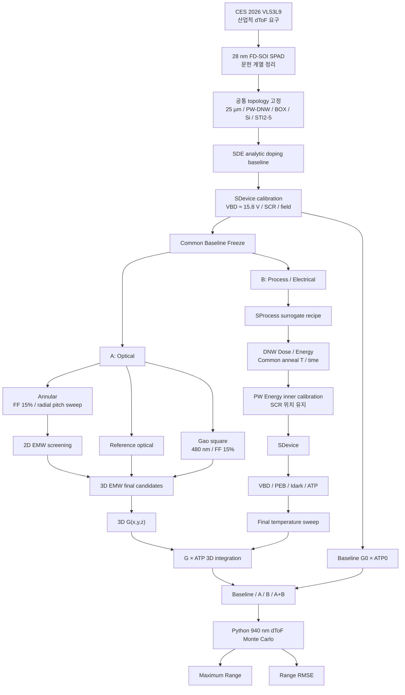

# CMP SPAD 공동 연구 기준 보고서
## CES 2026 dToF 응용을 출발점으로 한 28 nm FD-SOI SPAD 광학–공정–시스템 공동연구

**문서 상태:** 연구 방향 고정용 기준 문서 v1.0  
**작성 목적:** 앞으로 팀원 A·B 및 여러 AI가 연구를 이어갈 때, 이미 합의·정정된 연구 목적·baseline·실험변수·비교방법을 임의로 바꾸거나 과거의 잘못된 가정을 되살리지 않도록 하기 위한 **연구 기준 문서**이다.  
**핵심 원칙:** 실제 STMicroelectronics 양산 공정이나 VL53L9 내부 소자를 복제한다고 주장하지 않는다. 공개된 동일 연구계열의 논문으로 제약한 **문헌 제약 기반 대체 기준 SPAD(literature-constrained surrogate baseline)** 를 구축하고, 그 기준 위에서 A와 B가 독립 연구 후 마지막에 결합한다.

---

# 0. 이 문서를 사용할 때의 최우선 규칙

이 보고서의 목적은 단순 아이디어 정리가 아니라 **연구 방향의 드리프트 방지**이다. 이후 사람이든 AI든 다음 사항을 임의로 바꾸지 않는다.

1. **공통 baseline의 정체성은 Gao 2024의 28 nm FD-SOI quasi-circular reference SPAD 계열**이다.
2. 공통 baseline에는 **P-Well/Deep N-Well 접합, BOX, 상부 얇은 Si층, native STI topology**가 존재한다.
3. reference active zone의 native STI는 **STI2, STI3, STI4**이며, **STI5는 peripheral STI**이다.
4. native STI의 정확한 폭·간격·반경 위치는 공개되지 않았다. 이 값은 실제 공정값이라고 꾸며내지 않고 **surrogate dimension**으로 고정한 뒤 민감도 분석한다.
5. baseline 구조를 맞추기 위해 STI를 랜덤하게 움직여 \(V_{BD}\)를 억지로 맞추지 않는다.
6. 먼저 SDE/SDevice에서 **전기적으로 동등한 baseline doping profile**을 만든 뒤, B가 SProcess에서 이를 재현하는 **surrogate process recipe**를 구축한다.
7. A의 주요 optical pattern 비교에서는 **FF를 고정**한다. 현재 1차 고정값은 **Si pattern FF = 15%**이다.
8. A의 주요 독립변수는 **radial pitch**이다. ring width는 FF를 유지하기 위한 **종속변수**이다.
9. A의 주요 변수에서 **STI depth는 제외**한다. STI depth는 공정으로 정해진 고정값으로 취급한다.
10. reference에는 optical periodic pattern이 없으므로 **reference의 optical FF 또는 pitch를 정의하지 않는다**.
11. \(E_{\mathrm{edge}}/E_{\mathrm{center}}=1.12\)는 논문 보고값이 아니다. Fig. 9를 육안/픽셀 판독하여 얻었던 과거 참고 추정치일 뿐이며 **baseline hard target이나 논문 인용값으로 사용 금지**이다.
12. 180 nm는 STI 깊이가 아니다. **diffraction-grating/Si interface에서 SCR까지의 거리**로 보고된 optical-model anchor이다.
13. 2D EMW 결과를 동심원 3D 구조의 정확한 FDTD 결과라고 부르지 않는다. Sentaurus EMW의 2D FDTD는 구조를 제3방향으로 한 layer extrude하여 계산한다.
14. A의 동심원 구조는 “빛을 중앙 한 점으로 집속한다”는 가설을 사용하지 않는다. 목적은 **SCR/active region에서의 유효 photogeneration 증가**이다.
15. B의 DNW/PW는 **각각 implant 후 한 번의 공통 anneal**을 받는 simplified surrogate process를 사용한다. DNW와 PW의 anneal 온도/시간을 별도 자유변수처럼 두지 않는다.
16. B는 DNW **Dose, Energy**, 공통 **Anneal Temperature, Anneal Time**을 연구변수로 두고, PW implant energy는 SCR 위치를 맞추기 위한 종속 보정변수로 둔다. PW dose는 초기에는 고정한다.
17. B에서 dose를 바꿔도 A의 \(G\)를 1차적으로 재사용한다. 단, 이는 **광학상수의 도핑 의존성을 무시하는 명시적 근사**이며 “도핑은 광학에 절대 영향이 없다”라고 쓰지 않는다.
18. PEB는 field ratio 하나로 판정하지 않는다. **breakdown onset 위치, avalanche/impact-ionization 위치, central/edge field, reverse I–V**를 같이 본다.
19. dark current 감소를 곧바로 절대 DCR 감소(Hz/µm²)로 등치하지 않는다. 실측에 맞춘 trap/lifetime calibration이 없으면 **상대 dark-current / DCR proxy**로 제한한다.
20. A+B 결합은 \(G+ATP\)가 아니라 **공간적으로 곱해서 적분**한다.
21. 최종 dToF 비교는 VL53L9의 8.8~10 m 절대 성능을 재현하는 것이 아니라 **동일한 시스템 가정에서 baseline 대비 상대적 최대거리·RMSE 개선**을 평가한다.
22. CES 2026은 산업적 필요를 보여주는 출발점이다. DCR, photon starvation, pile-up 등의 세부 병목은 **학술·산업 기술문헌에서 알려진 문제**로 구분한다.

---

# 1. 연구 한 줄 정의

> **28 nm FD-SOI SPAD의 공통 reference를 문헌 기반으로 재구축한 뒤, A는 동일 Si fill factor에서 기존 square Si/STI optical pattern을 원형 SPAD에 대응하는 concentric annular Si/STI pattern으로 재설계하여 940 nm에서 유효 photogeneration을 높이고, B는 DNW dose/energy와 공통 thermal budget을 변화시키되 PW 조건으로 SCR 위치를 유지하면서 PEB·암조건 전류·온도 안정성을 개선한다. 마지막에는 A의 3D photogeneration \(G\)와 B의 avalanche triggering probability \(ATP\)를 결합하여 baseline 대비 dToF 최대 측정거리와 거리 RMSE의 변화를 평가한다.**

---

# 2. 연구의 출발점: CES 2026과 실제 연구의 관계

## 2.1 CES 2026에서의 산업적 출발점

CES 2026 Innovation Awards에는 STMicroelectronics의 **ST VL53L9 Time-of-Flight sensor**가 소개되었다.

CES 공식 설명에서 확인되는 핵심은 다음과 같다.

- direct ToF 기반 3D LiDAR
- 최대 약 **2.3k distance zones**
- 소형 물체 및 edge 검출
- 2D IR + 3D depth map
- on-chip dToF processing
- CES 소개 기준 약 **5 cm ~ 10 m** ranging

후속 ST VL53L9CX 공식 제품자료에서는 다음이 확인된다.

- receiving **SPAD array**
- 2개의 VCSEL flood illumination
- **940 nm** invisible light
- BSI stacked direct-ToF technology
- 최대 **54 × 42 zones**
- 현재 제품자료 기준 **<5 cm ~ 8.8 m**
- 최대 **100 Hz**
- 강한 ambient light 조건을 고려한 ranging
- metasurface optical elements 및 물리적 IR filter

### 중요
본 연구는 **VL53L9 내부 SPAD를 복제하지 않는다.**  
VL53L9은 산업적 요구를 보여주는 제품 사례이고, 실제 소자 연구는 공개 논문 계열의 28 nm FD-SOI SPAD를 사용한다.

## 2.2 CES 제품 요구를 소자 수준 문제로 번역

CES 제품이 보여주는 산업 요구는 다음과 같다.

- 먼 거리에서도 적은 반환광을 검출
- 낮은 반사율 물체 인식
- 실외/강한 주변광에서도 안정적 거리측정
- 많은 SPAD zone에서 안정적 동작
- 소형화와 높은 광검출 성능의 동시 달성

이를 SPAD 문헌에서 알려진 병목과 연결한다.

| 병목 | 근거 성격 | 본 연구와의 연결 |
|---|---|---|
| 장거리·낮은 반사율에서 photon starvation | 문헌 | **A 직접 대응**: 940 nm에서 SCR/active-region photogeneration 향상 |
| Si SPAD의 NIR 감도 한계 | 문헌 | **A 직접 대응**: optical STI interference를 이용한 \(G\) 향상 |
| DCR | 문헌 | **B 부분 대응**: 상대 dark generation/current 및 ATP 결합 |
| PEB | 문헌 | **B 직접 대응**: peripheral field/avalanche onset 개선 |
| 온도에 따른 \(V_{BD}\), DCR 변화 | 문헌 | **B 직접 평가**: final candidate temperature sweep |
| strong ambient light / pile-up | 문헌 | TCAD 해결대상이 아님. 최종 Python stress scenario에서만 평가 가능 |
| afterpulsing | 문헌 | 직접 해결대상 아님. A의 STI pattern이 고 \(V_{ex}\)에서 악화시킬 수 있으므로 한계로 기록 |
| crosstalk | 문헌 | 단일 SPAD 연구 범위 밖 |
| multi-path interference | 문헌 | 시스템/장면/신호처리 문제로 범위 밖 |

### 연구 프레이밍
A는 **원하는 photon signal을 더 잘 사용**하는 방향, B는 **전기적 안정성과 unwanted dark event 위험을 낮추는 방향**으로 역할을 나눈다.

---

# 3. 핵심 선행논문 계보와 본 연구에서 가져가는 내용

아래 논문들은 서로 무관한 숫자를 cherry-pick하기 위한 목록이 아니다. 대부분 **동일한 28 nm ST FD-SOI SPAD 연구계열의 연속 연구**이며, 공통 baseline의 identity·구조·전기·광학 제약을 단계적으로 보완한다.

## R1. Vignetti et al., 2017
**M. M. Vignetti et al., “Simulation study of a novel 3D SPAD pixel in an advanced FD-SOI technology,” Solid-State Electronics 128 (2017) 163–171.**  
DOI: https://doi.org/10.1016/j.sse.2016.10.014

### 직접 가져가는 것
- PW/DNW junction 기반 FD-SOI SPAD 개념
- 2D radial cut + cylindrical symmetry로 3D diode를 전기적으로 모델링하는 방법
- Sentaurus 기반 electric field, ionization coefficient, SRH/B2B generation 추출
- ATP 계산 방법
- \(DCR=\int P_{tr}(x)G_{EHP}(x)\,dx\) 형태의 DCR methodology
- PDP에서 multiplication region뿐 아니라 quasi-neutral region carrier collection을 고려하는 개념
- 940 nm ToF 응용을 직접 논의

### 직접 baseline으로 쓰지 않는 것
- 이 논문의 simulated SPAD active diameter는 **7 µm**
- \(V_{BD}\approx13.5\) V
- 이후 제작된 25 µm modified-DNW reference와 다른 초기 설계이므로 **geometry baseline 값으로 사용하지 않는다.**

---

## R2. Chaves de Albuquerque et al., 2018
**“Integration of SPAD in 28nm FDSOI CMOS technology,” ESSDERC 2018.**  
DOI: https://doi.org/10.1109/ESSDERC.2018.8486852

### 직접 확인되는 값
- commercial STMicroelectronics CMOS28FDSOI
- process customization 없이 첫 SPAD test chip
- PW/DNW junction
- octagonal-like staircase geometry와 square 비교
- Figure layout scale: 약 **25 µm**
- BFMOAT guard ring: **3.5 µm와 5 µm** 두 폭 제작
- original/native junction \(V_{BD}\approx9.6\) V at room temperature
- measured \(dV_{BD}/dT\approx6\) mV/K 수준
- square geometry에서 edge electroluminescence가 강하고 octagonal geometry에서 더 균일

### 본 연구에서의 역할
- 25 µm급 pseudo-circular 계열의 역사적 구조 근거
- PEB가 실제 layout/edge와 연결됨을 보여주는 실험 근거
- 단, **original DNW 구조이므로 최종 baseline의 \(V_{BD}\) 값으로 사용하지 않는다.**

---

## R3. Chaves de Albuquerque et al., 2019
**“Lowering the Dark Count Rate of SPAD Implemented in CMOS FDSOI Technology,” EUROSOI-ULIS 2019.**  
DOI: https://doi.org/10.1109/EUROSOI-ULIS45800.2019.9041916

### 직접 확인되는 내용
- original abrupt PW/DNW junction의 낮은 \(V_{BD}\)와 높은 B2B tunneling 문제
- optimized DNW는 conventional two-implant 대신 **single implant**
- 그 single implant energy는 original process의 second implant 대비 **약 +25%**
- optimized DNW는 original보다 **약 3배 낮게 도핑**
- metallurgical junction이 더 깊어짐
- \(V_{BD}\)가 약 **16 V**로 상승
- 같은 reverse bias에서 최대 electric field가 original 약 1 MV/cm, optimized에서 약 절반
- B2B generation rate가 **약 5 decades 감소**
- DCR proxy를 \(P_{tr}\times G_{B2B}\) 적분으로 계산

### 본 연구에서의 역할
B의 DNW energy/dose engineering이 물리적으로 타당하다는 가장 직접적인 초기 근거.

---

## R4. Chaves de Albuquerque et al., 2019
**“Body-biasing considerations with SPAD FDSOI: advantages and drawbacks,” ESSDERC 2019.**  
DOI: https://doi.org/10.1109/ESSDERC.2019.8901825

### baseline에 직접 가져가는 값
- **BOX thickness = 25 nm**
- **upper silicon film = 7 nm**

이는 같은 28 nm UTBB FD-SOI SPAD 연구계열에서 직접 공개된 값이므로 baseline stack의 문헌 제약값으로 사용한다.

---

## R5. Issartel et al., 2020
**“SPAD FDSOI cell optimization for lower dark count rate achievement,” EUROSOI-ULIS 2020.**  
DOI: https://doi.org/10.1109/EUROSOI-ULIS49407.2020.9365292

### 가져가는 구조적 의미
- reference / aligned STI / shifted STI 비교
- peripheral STI5가 PW/DNW junction edge와 관계
- active rectangular shapes 및 STI를 이용한 pseudo-circular layout 구현
- STI를 단순 광학 재료가 아니라 PEB/DCR와 연관된 전기 구조로 취급

### 주의
정확한 STI2/3/4 폭·spacing·radial position을 공정 수치로 공개하는 자료는 아니다. 따라서 **절대 치수는 여전히 비공개**이다.

---

## R6. Gao et al., 2021
**“3D Electro-optical Simulations for Improving the Photon Detection Probability of SPAD Implemented in FD-SOI CMOS Technology,” SISPAD 2021.**  
DOI: https://doi.org/10.1109/SISPAD54002.2021.9592555

### 매우 중요한 methodology
- electrical simulation: **2D cylindrical symmetry**
- optical simulation: **3D**
- electrical data를 cylindrical symmetry로 3D 확장한 뒤 optical \(G\)와 결합
- PDP:
\[
PDP(\lambda)=\frac{1}{\Phi_{\mathrm{photon}}}
\iiint ATP(x,y,z)\,G(x,y,z,\lambda)\,dV
\]

### optical design
- FF는 **한 square pattern에서 silicon area / total area**
- 먼저 period <100 nm에서 FF를 탐색
- 이후 period를 변화시켜 constructive interference maximum을 SCR에 배치
- fabrication candidate:
  - **FF = 0.15, 0.20, 0.25**
  - **period = 0.48 µm**
- example optical simulation incident power: 1 W/m²
- **SCR은 diffraction-grating/silicon substrate interface에서 약 180 nm 떨어져 있다고 명시**
- STI depth는 **technological process로 고정**
- STI width/length/spacing은 process design rule 제약을 받음

### 본 연구에서의 역할
A+B 결합 방법의 직접적인 선행 방법론.  
또한 A에서 STI depth를 독립변수로 빼는 근거.

---

## R7. Issartel et al., 2022
**“Architecture optimization of SPAD integrated in 28 nm FD-SOI CMOS technology to reduce the DCR,” Solid-State Electronics 191 (2022) 108297.**  
DOI: https://doi.org/10.1016/j.sse.2022.108297

### DNW modification
- modified DNW:
  - implant **dose 약 70% 감소**
  - implant **energy 약 25% 증가**
- junction 더 깊어짐
- SCR 확대
- original DNW \(V_{BD}\approx9.5\) V
- modified DNW \(V_{BD}\approx15.8\sim16\) V
- modified DNW에서 PDP **7% @ 650 nm, 6% excess voltage (\(V_{ex}\approx1.0\) V)** 보고

### STI / avalanche
- active-area STI가 carrier evacuation을 늦추고 secondary avalanche 가능성을 높임
- native reference의 peripheral STI block이 PW/DNW junction edge를 overlap하며 PEB/DCR 문제와 연관될 수 있다고 설명
- interface defect를 포함한 static TCAD에서 aligned STI가 peripheral field와 dark current 감소

### Table 1 — 역사적 architecture 비교
**주의: 아래 값은 모두 같은 2024 quasi-circular reference의 직접 baseline 값이 아니므로 baseline 수치표에 섞지 않는다.**

| 2022 structure | \(V_{BD}\) @20°C | \(V_{ex,max}\) | DCR @5% \(V_{BD}\) |
|---|---:|---:|---:|
| Original DNW Reference, Octagonal | 9.5 V | ≈6% | ≈800 Hz/µm² |
| Original DNW Reference, Circular | 9.5 V | ≈7% | ≈200 Hz/µm² |
| Modified DNW Reference, Octagonal | 15.8 V | ≈9% | ≈80 Hz/µm² |
| Modified DNW + aligned peripheral STI, Octagonal | 15.8 V | ≈20% | ≈15 Hz/µm² |
| Modified DNW + aligned STI + active STI removal, Octagonal | 15.8 V | ≈26% | ≈25 Hz/µm² |
| Modified DNW + aligned STI + active STI removal, Circular | 15.8 V | ≈26% | ≈20 Hz/µm² |

### 매우 중요한 금지사항
- 마지막 circular 20 Hz/µm² 구조는 **modified DNW만 적용한 circular reference가 아니라 all-optimized 구조**이다.
- modified-DNW octagonal의 80 Hz/µm²를 2024 quasi-circular reference의 baseline DCR로 사용하지 않는다.
- Fig. 9에서 \(E_{\mathrm{edge}}/E_{\mathrm{center}}=1.12\)라고 논문이 보고하지 않았다.

---

## R8. Gao et al., 2023
**“Correlations between DCR and PDP of SPAD integrated in a 28 nm FD-SOI CMOS Technology,” IISW 2023.**

### 공통 baseline topology에서 가장 중요한 논문
- SPAD: **25 µm diameter, pseudo-circular shape**
- standard 28 nm FD-SOI process **except DNW implant**
- 200 kΩ integrated passive quenching resistance
- **reference active zone에 design rule 때문에 STI2, STI3, STI4가 존재**
- **STI5 = peripheral STI**
- Fusion = active-zone STI를 제거/최소화
- Peripheral STI aligned + Fusion = STI5 정렬 + active STI 제거

### DCR/PDP trade-off
- reference는 STI oxide가 더 많고 같은 \(V_{ex}\)에서 높은 electric field/ATP와 높은 PDP를 보이나 DCR도 높음
- peripheral aligned + fusion은 낮은 DCR과 더 큰 usable \(V_{ex}\)를 가짐
- activation energy 약 **0.2–0.3 eV** 범위 → B2B + trap-assisted / field-enhanced generation mechanism의 조합 가능성

### B에 주는 핵심 의미
B가 implant/thermal profile만으로 layout을 그대로 둔 채 peripheral field/ATP/dark-generation을 얼마나 바꿀 수 있는지 검증할 근거가 된다.

---

## R9. Gao et al., 2024
**“Shallow Trench Isolation Patterning to Improve Photon Detection Probability of Single-Photon Avalanche Diodes Integrated in FD-SOI CMOS Technology,” Photonics 11(6), 526 (2024).**  
DOI: https://doi.org/10.3390/photonics11060526

### 공통 baseline identity의 주 기준
- 28 nm CMOS FD-SOI
- quasi-circular reference SPAD
- standard process except **modified Deep N-well implantation**
- reference와 동일 geometry에 STI optical pattern을 추가한 device 비교
- \(V_{BD}\approx15.8\) V at room temperature — **diode I–V 직접 측정**
- \(V_{HV0}\approx16.1\) V — embedded electronics detection threshold를 포함한 first detected avalanche voltage
- \(dV_{HV0}/dT\approx+11\) mV/°C
- BEOL은 존재하지만 photosensitive area에는 metallic BEOL을 열어 빛이 들어오도록 함
- ARC, microlens 없음

### square optical pattern
- selected pitch: **480 nm**
- FF: **15%, 20%, 25%**
- FF=15%, 480 nm:
  - **186 × 186 nm² SOI square**
  - **294 nm STI separation**
  - \(186+294=480\) nm
- SCR optical anchor: grating/Si interface에서 약 **180 nm**

### 측정 benchmark
- 2024 reference/patterned \(V_{BD}\) 계열: 약 15.8 V
- patterned DCR가 높은 \(V_{ex}\)에서 afterpulsing runaway를 보임
- \(V_{ex,max}\):
  - FF=15%: 약 **0.65 V (~4% \(V_{BD}\))**
  - FF=25%: 약 **0.8 V (~5% \(V_{BD}\))**
- activation energy: **~0.25 ± 0.05 eV**
- reference/patterned는 낮은 excess voltage 영역에서 comparable DCR 수준
- measured relative PDP gain example:
  - FF=15%: 약 **28% @ \(V_{ex}=0.4\) V**, **62% @ 0.5 V**
  - FF=25%: 약 **23% @ 0.5 V**, **131% @ 0.7 V**

### 우리 A의 직접 비교 대상
Gao square pattern은 “baseline”이 아니라 **기존 선행연구 benchmark**이다.

---

## R10. Synopsys Sentaurus Device EMW User Guide T-2022.03

### 본 연구에 중요한 사항
- EMW는 FDTD kernel 제공
- 3D periodic structure 및 plane-wave excitation 지원
- reflection, transmission, absorption 및 optical quantity 추출 가능
- integrated absorbed photon density 등 global quantity 저장 가능
- **2D simulation은 2D structure를 제3방향으로 한 layer extrude하여 3D FDTD kernel로 계산**
- 따라서 일반 2D EMW 결과를 “원통대칭 회전된 3D annular optical result”라고 해석하면 안 됨

### 본 연구 적용
- 2D EMW: 빠른 screening/경향 분석
- 최종 optical claim: 3D EMW

---

# 4. 공통 baseline의 정확한 정의

## 4.1 baseline의 명칭

**문헌 제약 기반 대체 기준 SPAD**  
영문 권장 표기: **Literature-Constrained Surrogate 28-nm FD-SOI SPAD Baseline**

### 왜 surrogate인가?
실제 ST foundry의 다음 값이 공개되지 않았기 때문이다.

- 절대 DNW/PW implant dose/energy
- 실제 species 및 multi-step recipe 전체
- activation fraction
- anneal 전체 history
- STI2/3/4/5의 정확한 width/spacing/radial position
- interface-trap density
- BEOL optical constants 전체

따라서 실제 mask/recipe를 복제했다고 주장할 수 없다.

### 왜 literature-constrained인가?
반대로 topology와 일부 핵심 치수/전기값은 동일 연구계열에서 직접 공개되므로 아무 구조나 만드는 것도 아니다.

---

# 5. 공통 baseline 상세 수치표

## 5.1 baseline을 직접 정의하는 값과 제약

| 항목 | 기준값/정의 | 출처 수준 | 사용 방법 |
|---|---|---|---|
| Technology | 28 nm FD-SOI CMOS | 2023/2024 직접 | 공통 platform |
| SPAD geometry | ~25 µm diameter, pseudo/quasi-circular | 2023 직접 | A/B active geometry |
| Junction | P-Well / Deep N-Well | 다수 직접 | core diode |
| DNW type | modified DNW | 2023/2024 직접 | common electrical baseline |
| Upper Si film | **7 nm** | 2019 same-lineage 직접 | FD-SOI stack |
| BOX | **25 nm** | 2019 same-lineage 직접 | FD-SOI stack |
| Active-zone native STI | **STI2, STI3, STI4** | 2023 직접 | baseline에 존재해야 함 |
| Peripheral STI | **STI5** | 2023 직접 | B의 PEB/DCR에 필수 |
| STI1/STI6/STI7 | anode/cathode/substrate isolation topology | schematic same-lineage | full cross-section 모델 시 포함 권장 |
| Optical periodic pattern | **없음** | reference 정의 | baseline은 square/annular pattern 아님 |
| \(V_{BD}\) | **~15.8 V @ room temperature** | 2024 실측 | 가장 강한 electrical calibration anchor |
| \(V_{HV0}\) | **~16.1 V** | 2024 실측 | 회로 threshold 포함 참고값 |
| \(dV_{HV0}/dT\) | **+11 mV/°C** | 2024 실측 | \(dV_{BD}/dT\)와 동일시 금지 |
| SCR optical anchor | grating/Si interface에서 **~180 nm** | 2021/2024 simulation | A/B 좌표 정합 anchor |
| 2024 optical illumination | FSI | 2021/2024 | A method validation |
| ARC | 없음 | 2024 직접 | benchmark 조건 |
| microlens | 없음 | 2024 직접 | benchmark 조건 |
| BEOL | standard BEOL, photosensitive opening | 2024 직접 | full optical model의 한계 명시 |
| Baseline absolute DCR | **고정하지 않음** | 2024에 curve 있으나 단일 공통 scalar로 쓰지 않음 | B는 relative comparison 우선 |
| \(E_{edge}/E_{center}\) | **baseline TCAD에서 직접 재추출** | 1.12 사용 금지 | 내부 PEB metric |

## 5.2 같은 연구계열에서 baseline을 검증하는 보조 값

| 항목 | 값 | 의미 |
|---|---:|---|
| Original DNW \(V_{BD}\) | ~9.5–9.6 V | native abrupt junction의 역사적 baseline |
| Modified DNW \(V_{BD}\) | ~15.8–16 V | 2024 reference와 일관성 |
| DNW dose change | original 대비 ~−70% | 2022에서 정리된 modified DNW 방향 |
| DNW energy change | original 대비 ~+25% | 2019/2022 modified DNW 방향 |
| Optimized DNW doping | original 대비 약 1/3 수준 | 2019 normalized profile 설명 |
| B2B generation change | 약 5 decades 감소 | 2019 TCAD trend |
| Active STI impact | quenching 지연/secondary avalanche 가능 | 2022 |
| Reference STI topology | STI2/3/4 active + STI5 peripheral | 2023 |

### 중요한 해석
이 보조값은 2024 baseline에 숫자를 무작위로 섞는 것이 아니다. **2024 reference의 modified-DNW identity가 앞선 동일 연구계열과 전기적으로 일관되는지 검증하는 constraint**이다.

---

# 6. 아직 공개되지 않은 baseline dimension과 처리 규칙

## 6.1 현재 미공개 항목
- STI2 width
- STI3 width
- STI4 width
- STI2–3–4 간 spacing
- 각 STI의 중심축으로부터 radial position
- STI5 width
- STI5의 PW/DNW junction overlap 길이
- 정확한 native minimum STI design rule
- absolute PW/DNW doping concentration

## 6.2 surrogate dimension의 정의

**Surrogate dimension**은:
> 논문이 topology와 상대적 역할을 보장하지만 절대 nm/µm 수치를 공개하지 않은 geometry에 대해, 문헌 그림·design-rule 관계·전체 25 µm geometry를 깨지 않는 하나의 대표 nominal dimension을 정하고, 그것을 실제 foundry 값이라고 주장하지 않는 것.

### 절대 금지
- STI 위치를 무작위로 움직여 \(V_{BD}=15.8\) V가 되는 조합을 찾기
- geometry와 doping을 동시에 자유롭게 fit하여 우연히 전기값을 맞추기
- 그림 pixel 길이를 실제 nm 값으로 직접 선언하기

## 6.3 surrogate dimension 결정 순서

1. **Topology 고정**
   - active: STI2/3/4
   - peripheral: STI5
   - full contact domain 사용 시 STI1/6/7 포함
2. 논문 Figure의 상대적 ordering과 25 µm active diameter를 사용해 **nominal geometry**를 하나 정함
3. nominal STI geometry는 baseline doping calibration 동안 고정
4. PW/DNW analytic doping만 먼저 calibration
5. baseline 통과 후 STI dimension uncertainty에 대해 sensitivity 수행
   - 예: nominal × 0.8 / 1.0 / 1.2
6. PEB, \(V_{BD}\), SCR, dark current가 STI uncertainty에 매우 민감하면 그 사실 자체를 limitation으로 보고

---

# 7. 공통 baseline 구축 절차 — Stage 0~2

## Stage 0. Geometry freeze

### 도구
- Sentaurus SDE

### 해야 할 일
- 2D \(r-z\) half-cell 구조
- quasi-circular 25 µm SPAD를 cylindrical symmetry로 해석 가능한 형태로 구성
- 7 nm upper Si
- 25 nm BOX
- P-Well
- modified-DNW target region
- N-Well/cathode
- substrate
- native STI2/3/4
- peripheral STI5
- 필요 시 STI1/6/7
- 모든 좌표의 공통 \(z=0\) 기준면 정의

### 권장 공통 좌표
A/B 통합을 위해:
> \(z=0\): optical grating/Si substrate interface에 대응하는 공통 기준면

그 후 SCR 위치를 이 기준면에 대해 저장한다.

---

## Stage 1. SDE analytic doping → SDevice electrical calibration

### 목적
실제 비공개 foundry recipe를 역산하는 것이 아니라 **전기적으로 동등한 목표 doping profile**을 먼저 찾는다.

### SDE analytic profile
PW와 DNW 각각에 대해 Gaussian/erf-type profile parameter를 사용 가능.

대표 fit parameter:
- peak position \(R_p\)
- profile spread \(\Delta R_p\)
- peak concentration \(N_{peak}\)

### calibration target
1. \(V_{BD}\approx15.8\) V
2. PW/DNW junction 위치
3. SCR 중심/폭
4. 2022 Fig. 12의 **normalized net-doping profile shape**와 qualitative consistency
5. central electric-field profile
6. peripheral field shape
7. reverse I–V trend
8. 180 nm optical anchor와의 좌표 정합 여부

### 중요
- 6개 변수 대 5개 지표라고 해서 유일해가 보장되지 않는다.
- \(V_{BD}\), SCR width, field는 상관된 출력이므로 여러 profile이 비슷한 결과를 만들 수 있다.
- 따라서 scalar target뿐 아니라 **profile shape**와 field shape를 함께 사용한다.

### baseline PASS
- \(V_{BD}\)가 15.8 V 부근으로 일관되게 재현
- 정상적인 중앙 multiplication region
- reference topology에 맞는 peripheral field
- SCR extraction rule 재현 가능
- mesh refinement 후 주요 지표 수렴
- A/B 공통 좌표계 확정

---

## Stage 1.5. dark-current/defect model calibration

### 이유
\(V_{BD}\), SCR, field는 주로 net doping profile에 의해 결정되지만 dark current는 그렇지 않다.

필요한 추가 물리:
- SRH
- BTBT
- 가능하면 TAT/field-enhanced trap model
- carrier lifetime
- Si/SiO₂ interface defect
- fixed charge/interface trap assumptions

### 원칙
실제 ST의 \(D_{it}\), lifetime은 비공개이므로:
- 절대 DCR 예측을 주 목표로 하지 않음
- **동일 defect/lifetime model에서 case-to-case 상대 변화**를 비교
- 가능하면 dark generation component를 분해

### defect sensitivity
동일 geometry/doping에서:
- interface defect OFF
- interface defect ON
- 문헌 기반 여러 defect assumption

을 비교한다.

이 결과를 “곡률 70%, defect 30%”처럼 단순 가산적 원인 기여율로 해석하지 않는다.  
목적은 **process-only optimization이 interface-defect uncertainty에 얼마나 민감한지 확인**하는 것이다.

---

## Stage 2. SProcess surrogate recipe 구축

### 목적
Stage 1에서 확정한 target PW/DNW profile을 재현하는 **대체 공정 recipe**를 찾는다.

### 절대 금지
“실제 ST recipe를 복원했다.”

### 프로젝트에서 사용하는 simplified process abstraction
1. DNW implant
2. PW implant
3. **공통 anneal 1회**
4. 최종 structure export
5. SDevice evaluation

### SProcess baseline fit에 쓰는 문헌 constraint
- modified DNW는 original 대비 **dose 감소 방향**
- modified DNW는 **energy 증가 방향**
- 2022 reference: 약 −70% dose, +25% energy라는 상대 변화
- 최종 profile은 Stage 1 target과 유사해야 함
- 최종 \(V_{BD}\), SCR, E-field가 Stage 1 electrical baseline과 일치해야 함

### recipe가 여러 개 가능할 때
profile을 잘 재현하는 여러 recipe 중 하나를 **surrogate process baseline**으로 선택할 수 있다.  
중요한 것은 실제 foundry recipe의 유일한 복원이 아니라 **B DOE를 시작할 재현 가능한 기준공정**이다.

---

# 8. A 팀원 연구 — Optical Annular STI Design

# 8.1 A의 독립 연구 질문

> **동일한 28 nm FD-SOI SPAD core와 동일한 Si pattern fill factor를 유지하면서, 기존 square STI optical pattern을 concentric annular Si/STI pattern으로 변경하고 radial pitch를 조절하면 940 nm에서 SPAD active region의 유효 photogeneration을 증가시킬 수 있는가?**

# 8.2 A의 목적

A의 목적은 “빛을 중앙 한 점으로 모으기”가 아니다.

목표:
- diffraction/interference에 의해 **SCR/active-region과 유리한 위치에서 optical intensity를 증가**
- \(G_{\mathrm{SCR}}\) 또는 active-region weighted \(G\)를 높임
- 기존 Gao square benchmark와 동일 FF에서 geometry effect를 비교
- 940 nm photon-starved dToF 조건에서 유리한 optical detector design 제안

# 8.3 A가 고정하는 것

- common baseline electrical core
- 25 µm class active geometry
- PW/DNW profile
- SCR location
- STI depth
- optical material dataset
- incident flux normalization
- primary comparison FF = **15%**
- application wavelength = **940 nm**
- baseline/native STI topology
- final comparison aperture

# 8.4 A가 바꾸는 것

### 독립변수
- **radial pitch \(T_r\)**

### 종속변수
- **annular Si ring width**
- 필요 시 STI ring width

조건:
\[
FF_{\mathrm{Si,annular}} = FF_{\mathrm{Si,Gao}} = 0.15
\]

annular 구조는 ring area:
\[
A_i=\pi(r_{o,i}^2-r_{i,i}^2)
\]
를 사용하여 전체 photosensitive aperture에서 **global Si area fraction**이 15%가 되도록 width를 계산한다.

### 중요
FF 고정 시 pitch와 width는 독립변수가 아니다.  
pitch를 바꾸면 width는 FF를 유지하기 위해 자동으로 바뀐다.

---

# 9. A의 비교 구조 3종

## A0. Reference
- 공통 baseline
- native STI2/3/4 + peripheral STI5 존재
- **의도적 optical periodic nanostructure 없음**
- optical pitch/FF를 정의하지 않음

## A1. Gao Square Benchmark
- 동일 baseline core
- 2024 square pattern
- primary benchmark:
  - pitch = **480 nm**
  - FF = **15%**
  - 186 × 186 nm² SOI square
  - 294 nm STI separation

## A2. Proposed Annular
- 동일 baseline core
- global FF = 15%
- radial pitch sweep
- 각 pitch에서 ring width 자동 재계산

---

# 10. A의 선행과제 및 실험 단계

## A-Pre-0. EMW 도구 검증
- EMW executable/license 확인
- 3D SDE → tensor mesh → EMW 연결 확인
- 940 nm plane wave 실행
- Si/SiO₂ complex refractive index source 고정
- \(G\), \(|E|\), reflection/transmission export 확인
- mesh convergence 확인

## A-Pre-1. 2D baseline sanity
목적:
- geometry/optical stack이 비정상적으로 반사/흡수하지 않는지 확인
- reference vs patterned에서 문헌과 같은 **방향성**이 나오는지 빠르게 확인

### 주의
2D EMW는 정확한 annular 3D optical model이 아니다.
EMW manual상 2D 구조는 third direction에 one-layer extrude된다.

따라서:
> “2D 결과가 좋은 pitch = 3D annular에서도 정확히 최적”
이라고 가정 금지.

## A-Pre-2. Gao 3D optical solver validation

### 권장 단계
1. 작은 3D periodic square unit cell
2. pitch 480 nm, FF 15%
3. published square geometry 사용
4. periodic lateral boundary
5. normal incidence
6. photogeneration hotspot 및 patterned/reference trend 확인

이 단계는 25 µm 전체 SPAD를 처음부터 3D로 계산하지 않고 **solver와 square-pattern optics를 검증**하기 위한 단계이다.

## A-1. 2D screening
- radial pitch 후보 여러 점
- 각 pitch별 FF=15% 유지
- reference/common SCR 위치 고정
- photogeneration depth profile
- approximate \(G_{\mathrm{SCR}}\)
- reflection/transmission
- 후보 clustering

### 후보 선정
단순 1~5등만 뽑지 않는다.
- 낮은 pitch 영역
- 중간 pitch 영역
- 높은 pitch 영역
- local maxima
- 안정한 plateau

를 대표하는 후보 약 5개 선정.

## A-2. 3D annular geometry 생성
SDE 3D에서:
- 공통 SPAD core
- concentric annular Si/STI rings
- pitch별 width 자동 계산
- active aperture boundary에서 정확한 area accounting
- global FF 검증

## A-3. 3D final EMW
최소 비교:
1. Reference
2. Gao square 480 nm / 15%
3. Proposed annular final candidates

동일:
- wavelength
- source intensity
- material optical constants
- active aperture
- mesh rule
- boundary convention
- SCR/active-region mask

## A-4. polarization/form-birefringence 확인
annular geometry는 local radial/tangential orientation을 가지므로:
- two orthogonal linear polarizations
- 또는 polarization averaged/unpolarized metric

을 final candidate에서 확인한다.

목표는 “x 편광이 y 편광보다 반드시 총 PDP가 다르다”가 아니라:
- local azimuthal \(G\) nonuniformity
- polarization averaged \(G\)
- robustness

를 확인하는 것이다.

## A-5. A의 최종 metric

### A1. SCR-integrated photogeneration
\[
G_{\mathrm{SCR}}=\iiint_{\mathrm{SCR}}G(x,y,z)\,dV
\]

### A2. active-region weighted generation
Gao methodology에 맞추어 quasi-neutral collection region까지 포함 가능.

### A3. optical gain
\[
Gain_G=\frac{G_{\mathrm{candidate}}}{G_{\mathrm{reference}}}
\]

### A4. square 대비 gain
\[
Gain_{A/Square}=\frac{G_{\mathrm{annular}}}{G_{\mathrm{square}}}
\]

### A5. wavelength robustness
940 nm 단일점만이 아니라 인접 파장 몇 점 확인.

### A의 개인 최종 산출물
- 2D screening map
- 3D reference/square/annular field maps
- 3D \(G\) maps
- \(G_{\mathrm{SCR}}\) comparison
- polarization sensitivity
- final annular design
- **Annular Optical Design Window**

---

# 11. B 팀원 연구 — Process/Electrical Robustness

# 11.1 B의 독립 연구 질문

> **reference peripheral-STI layout을 유지한 상태에서 DNW dose/energy와 공통 anneal thermal budget을 조절하고, PW implant energy를 이용해 SCR을 baseline 위치에 유지할 때, PEB 위험과 dark-generation을 줄이면서 usable avalanche operation을 개선할 수 있는 공정영역이 존재하는가?**

# 11.2 B의 핵심 목적

1. **SCR 위치 유지**
2. peripheral field/avalanche onset 개선
3. PEB margin 개선
4. central \(V_{BD}\)를 적절한 operating range에 유지
5. relative dark current/dark generation 감소
6. ATP map 확보
7. final candidates에서 온도 안정성 평가

### 중요한 표현
\(V_{BD}\)는 “높을수록 무조건 좋다”가 아니다.  
B의 목적은 **SCR·PEB·dark current와 함께 안전한 운용범위를 확보**하는 것이다.

---

# 12. B의 변수 구조

## 독립변수
\[
D_{\mathrm{DNW}}
\]
DNW implant dose

\[
E_{\mathrm{DNW}}
\]
DNW implant energy

\[
T_{\mathrm{anneal}}
\]
공통 anneal temperature

\[
t_{\mathrm{anneal}}
\]
공통 anneal time

## 종속 보정변수
\[
E_{\mathrm{PW}}
\]
PW implant energy — 각 DNW/anneal 조건에서 SCR 위치를 baseline에 다시 맞추기 위한 내부 조정변수.

## 초기 고정
- PW dose
- implant species assumption
- native STI geometry
- active diameter
- common anneal sequence

### 중요한 공정 흐름
```text
DNW implant
    +
PW implant
    ↓
common anneal 1회
    ↓
final DNW/PW profile
    ↓
SDevice
```

DNW anneal과 PW anneal을 별도 실험으로 분리하지 않는다.

---

# 13. B의 DOE 진행 방법

4개 독립변수를 한 번에 3×3×3×3=81 full factorial로 돌리는 것은 비효율적일 수 있다.

## 권장 Stage B1 — DNW implant screening
nominal anneal에서:
- DNW Energy sweep
- DNW Dose sweep
- 각 case마다 PW Energy inner-loop calibration

목표:
- SCR target 유지 가능한 영역
- \(V_{BD}\)와 peripheral field의 큰 경향 확인

## Stage B2 — Thermal budget screening
B1의 유망 DNW 조건에서:
- anneal temperature
- anneal time
- 각 조건마다 PW Energy 재보정

목표:
- diffusion/activation으로 SCR 및 field가 어떻게 바뀌는지 확인

## Stage B3 — Local coupled DOE
유망영역에서:
- DNW dose
- DNW energy
- temperature
- time

을 좁은 범위에서 조합.

## Inner loop — PW Energy calibration
각 B case에서:
1. PW energy 초기값
2. DNW/PW implant
3. common anneal
4. SDevice/SVisual에서 SCR 위치 추출
5. baseline \(z_{\mathrm{SCR}}\)와 비교
6. PW energy 조정
7. 전체 process 재실행
8. tolerance 만족 시 case accepted

### 필수 constraint
\[
\Delta z_{\mathrm{SCR}}
=z_{\mathrm{SCR,case}}-z_{\mathrm{SCR,baseline}}
\approx0
\]

---

# 14. B의 전기 평가 지표

## B1. SCR
- center depth
- width
- radial extent
- baseline shift

## B2. breakdown
- \(V_{BD}\)
- reverse I–V
- breakdown onset location

## B3. central/edge field
내부 비교용:
\[
R_E=\frac{E_{\mathrm{edge}}}{E_{\mathrm{center}}}
\]

### 주의
- baseline \(R_E\)는 우리 TCAD에서 직접 정의/추출
- 1.12를 literature target으로 쓰지 않음
- center/edge sampling location을 고정하고 문서화

## B4. PEB 판정
다음 4가지를 함께 사용:
1. edge vs center field
2. avalanche/impact-ionization generation peak 위치
3. breakdown onset 위치
4. I–V behavior

classification 예:
- SAFE
- MARGINAL
- PEB-RISK

## B5. dark condition
- \(I_{\mathrm{dark}}(V)\)
- SRH contribution
- BTBT contribution
- TAT/field-enhanced contribution if available
- edge vs center spatial generation

### 절대 DCR 주의
실측 trap/lifetime calibration 없이:
> “DCR = xx Hz/µm²”
를 최종 예측값으로 주장하지 않는다.

대신:
\[
DarkGain_i=
\frac{I_{\mathrm{dark},i}}
{I_{\mathrm{dark,baseline}}}
\]
또는
\[
DCR_{\mathrm{proxy},i}
\propto
\iiint ATP_i(\mathbf r)G_{\mathrm{dark},i}(\mathbf r)dV
\]
를 사용한다.

---

# 15. B의 interface-defect sensitivity

2022/2023 연구는 STI/PW interface defect가 DCR와 peripheral behavior에 관여할 가능성을 제시한다.

## 목적
“PEB의 몇 %가 curvature이고 몇 %가 defect인가”를 억지로 나누는 것이 아니다.

질문:
> **B의 process-only optimization 효과가 unknown interface defect assumption에도 유지되는가?**

## 실험
동일 geometry/profile에서:
- Defect OFF
- Defect nominal assumption
- Defect higher/lower sensitivity cases

평가:
- \(R_E\)
- edge dark generation
- impact-ionization map
- \(I_{\mathrm{dark}}\)
- ATP

## 해석
- defect condition을 바꿔도 B optimum이 유지 → process approach robust
- defect가 강하면 process-only gain 제한 → layout/interface engineering이 필요하다는 유의미한 결론

---

# 16. B의 온도 실험

최종 baseline + 유망 B candidates에만 적용.

권장 temperature:
- 0°C
- 25°C
- 50°C
- 75°C

평가:
- \(V_{BD}(T)\)
- \(dV_{BD}/dT\)
- \(I_{\mathrm{dark}}(T)\)
- \(R_E(T)\)
- usable \(V_{ex}\) margin

### 중요
2024의 +11 mV/°C는 **\(V_{HV0}\)** temperature coefficient이다.  
우리 SDevice의 \(dV_{BD}/dT\) validation target과 동일한 값으로 강제하지 않는다.

---

# 17. B가 dose를 바꿔도 A의 \(G\)를 재사용할 수 있는가?

## 연구에서의 1차 근사
A의 EMW에서 Si/SiO₂ optical constants를 고정한다면, B가 well dose를 바꿔도 optical geometry와 optical material input이 같으므로 **A의 \(G(x,y,z)\)를 재사용**한다.

### 왜 가능한가?
B의 주 효과:
- net doping
- electric field
- SCR
- mobility/lifetime
- ATP
- dark generation

A의 주 효과:
- optical geometry
- diffraction/interference
- photogeneration field

### 단, 절대명제로 쓰지 않는다
고농도 doping은 실제로 refractive index/free-carrier absorption에 영향을 줄 수 있다. 본 연구는 well-dose 범위에서 이를 2차 효과로 보고 **fixed optical-property approximation**을 사용한다.

필요하면 최종 B candidate에서 optical-constant sensitivity를 추가한다.

---

# 18. A와 B의 독립성

## A 개인결론
A는 B가 없어도 다음을 결론낼 수 있어야 한다.

> “동일 baseline core와 FF에서 square → annular geometry 변경 및 radial pitch 최적화가 940 nm active-region photogeneration에 미치는 영향.”

## B 개인결론
B는 A가 없어도 다음을 결론낼 수 있어야 한다.

> “reference STI layout을 유지하면서 DNW/PW/thermal profile engineering으로 SCR 위치를 유지하고 PEB·dark generation·temperature robustness를 얼마나 개선할 수 있는가.”

## 공동 결론
마지막에만 서로 결과를 결합한다.

---

# 19. A+B 결합 방법

## 19.1 데이터 형식

A:
\[
G_A(x,y,z,\lambda)
\]

B:
\[
ATP_B(r,z)
\]

B는 axisymmetric electrical model이므로 3D grid로 mapping:
\[
r=\sqrt{(x-x_c)^2+(y-y_c)^2}
\]

\[
ATP_B(x,y,z)=ATP_B(r,z)
\]

## 19.2 PDP / relative detection quantity

Gao methodology:
\[
PDP(\lambda)=
\frac{1}{\Phi_{\mathrm{photon}}(\lambda)}
\iiint_V ATP(\mathbf r)G(\mathbf r,\lambda)dV
\]

절대 PDP calibration이 충분하지 않으면:
\[
Q=\iiint_V ATP(\mathbf r)G(\mathbf r)dV
\]

\[
RelativePDP_i=
\frac{Q_i}{Q_0}
\]

### carrier collection
940 nm에서는 SCR 바깥에서 생성된 carrier contribution도 중요할 수 있다.  
따라서 가능하면 Gao 2021/2024처럼:
- SCR
- p-side quasi-neutral active region
- n-side quasi-neutral active region

을 electrical field와 drift/diffusion criterion으로 정의한다.

필요하면:
\[
Q=\iiint G\cdot P_{\mathrm{collection}}\cdot ATP\,dV
\]
형태로 확장한다.

---

# 20. 최종 네 가지 detector case

| Case | Optical \(G\) | Electrical \(ATP\) / dark | 목적 |
|---|---|---|---|
| Baseline | \(G_0\) | \(ATP_0\) | 기준 |
| A-only | \(G_A\) | \(ATP_0\) | optical 기여 분리 |
| B-only | \(G_0\) | \(ATP_B\) | process/electrical 기여 분리 |
| A+B | \(G_A\) | \(ATP_B\) | 최종 공동효과 |

추가 optical benchmark:
- Gao square + baseline electrical

이렇게 해야 annular가 기존 square보다 나은지 별도 판단 가능하다.

---

# 21. Python dToF 최종 평가

# 21.1 목적
TCAD 결과를 시스템 수준의 의미로 변환한다.

최종 질문:
> **같은 940 nm 송수신 시스템에서 detector만 baseline/A/B/A+B로 바꿨을 때 최대 측정거리와 거리 RMSE가 얼마나 바뀌는가?**

# 21.2 고정해야 하는 시스템 조건
- wavelength = 940 nm
- laser pulse energy / optical power
- repetition rate
- receiver aperture
- optical transmission
- target reflectance
- ambient photon flux
- gate width
- integration time
- TDC bin width
- laser timing jitter
- optical FoV
- detection threshold rule

모든 detector case에서 동일.

# 21.3 photon budget

광자 에너지:
\[
E_\gamma=\frac{hc}{\lambda}
\]

송신 photon:
\[
N_{tx}=\frac{E_{pulse}}{E_\gamma}
\]

간단한 diffuse target에서 return photon은 대략 거리의 제곱에 반비례:
\[
N_{return}\propto\frac{\rho A_{rx}\eta_{opt}}{R^2}N_{tx}
\]

detected signal:
\[
\mu_s=N_{return}\cdot PDP
\]

background:
\[
\mu_b=\mu_{\mathrm{ambient}}+\mu_{\mathrm{dark}}
\]

# 21.4 B의 dark-current를 Python에 넣는 방법

절대 DCR을 TCAD에서 확정할 수 없으면:
1. baseline DCR scenario \(DCR_0\)를 literature/system assumption으로 둠
2. B의 relative dark factor:
\[
k_B=\frac{DCR_{\mathrm{proxy},B}}{DCR_{\mathrm{proxy},0}}
\]
3. Python:
\[
DCR_B=k_BDCR_0
\]

이렇게 하면 TCAD가 제공하지 못하는 절대 calibration을 꾸며내지 않고 상대 개선만 시스템 모델에 전달할 수 있다.

# 21.5 Monte Carlo
- signal count: Poisson
- ambient/dark count: Poisson
- signal timestamp: true ToF 주변 timing distribution
- background timestamp: gate 내 분포
- TDC binning
- histogram peak/centroid/estimator
- 반복 simulation

거리:
\[
R=\frac{ct}{2}
\]

RMSE:
\[
RMSE_R=\sqrt{\frac1N\sum_i(\hat R_i-R_{true})^2}
\]

# 21.6 최대 측정거리 정의
최대거리는 임의로 “마지막으로 signal이 보이는 거리”라고 하지 않는다.

예:
- detection probability ≥ 95%
- RMSE ≤ 사전 정의 threshold
- false-alarm rate ≤ 사전 정의 threshold

를 동시에 만족하는 가장 큰 \(R\).

---

# 22. 최종 비교와 기대 결론 형태

## Baseline vs A
- \(G\) / relative PDP 증가
- maximum range 증가 여부
- RMSE 변화

## Baseline vs B
- SCR 유지
- PEB risk 감소
- relative dark noise 감소
- temperature robustness
- relative PDP/ATP 변화

## Baseline vs A+B
최종:
\[
\Delta R_{max}
=
\frac{R_{max,AB}-R_{max,0}}
{R_{max,0}}
\]

\[
\Delta RMSE
=
\frac{RMSE_{AB}-RMSE_0}
{RMSE_0}
\]

### 올바른 최종 주장 예
> “문헌 제약 기반 28 nm FD-SOI surrogate SPAD에서 annular optical pattern과 process-engineered electrical profile을 결합한 결과, 동일한 940 nm dToF scenario에서 baseline 대비 effective detection quantity가 증가하고 최대 측정거리가 증가했으며 거리 RMSE가 감소하였다.”

### 금지 주장
> “VL53L9의 최대거리를 xx m 개선했다.”

---

# 23. 전체 연구 workflow



### 텍스트 요약
```text
CES 산업 문제
    ↓
문헌 계열 확정
    ↓
공통 28 nm FD-SOI surrogate baseline
    ↓
SDE + SDevice electrical calibration
    ↓
┌───────────────────────┬────────────────────────┐
│ A Optical             │ B Process/Electrical   │
│ FF=15%                │ DNW Dose/Energy        │
│ radial pitch sweep    │ common anneal T/time   │
│ ring width dependent  │ PW Energy calibration │
│ 2D screen → 3D EMW    │ SProcess → SDevice    │
└──────────┬────────────┴───────────┬────────────┘
           │ 3D G                   │ ATP/Idark/PEB
           └─────────────┬──────────┘
                         ↓
                 G × ATP integration
                         ↓
             baseline / A / B / A+B
                         ↓
                 Python 940 nm dToF
                         ↓
                최대거리 + 거리 RMSE
```

---

# 24. 각 팀원의 선행과제 체크리스트

## 공동 선행과제
- [ ] 모든 핵심 논문 PDF 저장
- [ ] source/provenance table 유지
- [ ] common coordinate 정의
- [ ] surrogate STI dimension versioning
- [ ] baseline geometry hash/version 고정
- [ ] SDE analytic doping calibration
- [ ] baseline \(V_{BD}\) extraction rule
- [ ] SCR extraction rule
- [ ] center/edge sampling location rule
- [ ] mesh convergence
- [ ] baseline PASS 보고서 작성

## A 선행과제
- [ ] EMW executable/license 검증
- [ ] 2D→EMW tensor mesh workflow
- [ ] 3D SDE geometry workflow
- [ ] Si/SiO₂ optical constants source 고정
- [ ] 940 nm plane wave normalization
- [ ] 480 nm / FF15 square unit-cell 검증
- [ ] 2D EMW가 annular exact model이 아님을 코드/보고서에 명시
- [ ] annular global FF 계산기 작성
- [ ] pitch → ring width 자동 생성기
- [ ] 3D \(G\) export
- [ ] SCR mask와 grid alignment
- [ ] polarization test
- [ ] 3D mesh convergence

## B 선행과제
- [ ] Stage1 target doping profile 저장
- [ ] SProcess DNW implant test
- [ ] SProcess PW implant test
- [ ] common anneal flow test
- [ ] SProcess→SDevice data 전달
- [ ] DNW dose parameterization
- [ ] DNW energy parameterization
- [ ] PW energy inner-loop calibration
- [ ] SCR 자동 extraction
- [ ] \(V_{BD}\) 자동 extraction
- [ ] central/edge field 자동 extraction
- [ ] avalanche onset map
- [ ] relative dark current components
- [ ] interface defect sensitivity deck
- [ ] final temperature sweep setup

## Integration 선행과제
- [ ] A 3D grid와 B r-z coordinate alignment
- [ ] \(r=\sqrt{x^2+y^2}\) mapping 검증
- [ ] ATP extraction/post-processing 검증
- [ ] active volume definition
- [ ] \(G\times ATP\) unit consistency
- [ ] baseline normalization
- [ ] A/B/A+B case generator

## Python dToF 선행과제
- [ ] fixed system parameter file
- [ ] 940 nm photon budget
- [ ] reflectivity scenarios
- [ ] ambient scenarios
- [ ] detector relative PDP input
- [ ] relative dark scaling
- [ ] Poisson photon generator
- [ ] timing model
- [ ] TDC histogram
- [ ] range estimator
- [ ] maximum-range criterion
- [ ] RMSE
- [ ] reproducible random seed

---

# 25. 연구 실패/분기 기준

## A
다음 상황이면 결과 범위를 줄인다.
- 3D EMW 계산이 현실적으로 불가능
- 2D screening과 3D 후보 순위 상관이 매우 낮음
- annular polarization sensitivity가 지나치게 큼
- annular가 square benchmark보다 유의한 \(G\) improvement 없음

### 이 경우에도 유의미한 결론
“동일 FF에서 annular geometry가 기존 square geometry보다 우월하지 않으며, square periodicity가 해당 SCR depth에서 더 적합하다.”

## B
- PW energy로 SCR 위치를 target 범위에 맞출 수 없음
- process-only profile change가 PEB를 거의 개선하지 못함
- interface defects에 의해 process gain이 소실
- dark current와 PEB가 반대 trade-off를 보임

### 이 경우에도 유의미한 결론
“native peripheral-STI layout을 유지한 process-only optimization의 한계가 존재하며, aligned STI/interface engineering이 필요하다.”

---

# 26. 결과 해석 시 반드시 구분할 값

| 값 | 의미 | 주의 |
|---|---|---|
| \(V_{BD}\) | diode breakdown voltage | 2024 baseline ~15.8 V |
| \(V_{HV0}\) | on-chip circuit가 avalanche를 처음 검출하는 최소 HV | 2024 ~16.1 V, \(V_{BD}\)와 다름 |
| \(dV_{HV0}/dT\) | circuit-inclusive threshold temperature coefficient | +11 mV/°C, \(dV_{BD}/dT\)로 직접 쓰지 않음 |
| \(G\) | optical photogeneration | A output |
| ATP | avalanche triggering probability | B output |
| DCR | dark avalanche event rate | absolute prediction에는 calibration 필요 |
| \(I_{dark}\) | dark current | DCR과 동일하지 않음 |
| FF | optical pattern silicon area fraction | pixel fill factor와 혼동 금지 |
| 180 nm | grating/Si interface → SCR distance | STI depth가 아님 |
| 1.12 | 과거 Fig.9 판독 추정 | 문헌값 아님, baseline에서 재추출 |
| 80 Hz/µm² | 2022 modified-DNW octagonal reference @5% | 2024 quasi-circular baseline DCR로 사용 금지 |
| 20 Hz/µm² | 2022 all-optimized circular | modified-DNW-only 값 아님 |

---

# 27. reference / square / annular의 정확한 관계

```text
[Common Electrical Core]
25 µm quasi-circular FD-SOI
PW / modified-DNW
BOX 25 nm
upper Si 7 nm
native STI topology
        │
        ├─ Reference
        │   └─ no intentional periodic optical pattern
        │
        ├─ Gao Square
        │   └─ 480 nm pitch / FF 15% primary benchmark
        │
        └─ Proposed Annular
            └─ FF 15% fixed / radial pitch variable / width dependent
```

Reference에는 native STI2/3/4가 존재하지만 **480 nm optical periodic lattice가 없는 상태**이다.

---

# 28. 향후 AI가 절대 되살리면 안 되는 과거 오류

1. **오류:** “reference는 STI2/3/4가 없는 평평한 SPAD다.”  
   **정정:** 2023 논문이 reference active zone의 STI2/3/4 존재를 직접 명시.

2. **오류:** “reference의 FF를 15%로 맞춘다.”  
   **정정:** reference는 optical periodic unit cell이 없으므로 pattern FF 정의 대상이 아님.

3. **오류:** “A는 pitch와 width를 독립적으로 sweep한다.”  
   **정정:** FF=15% 고정이므로 pitch가 독립, width는 종속.

4. **오류:** “A는 STI depth를 sweep한다.”  
   **정정:** 현재 연구에서는 제외. depth는 process-fixed.

5. **오류:** “2D EMW를 원형 회전하면 exact 3D optical result다.”  
   **정정:** EMW 2D는 extruded FDTD. final optical claim은 3D.

6. **오류:** “동심원은 중앙으로 빛을 focusing한다.”  
   **정정:** 주목표는 SCR/active-region \(G\) 증가와 depth/overlap 최적화.

7. **오류:** “1.12는 Issartel 논문값.”  
   **정정:** 아니다. baseline에서 재추출.

8. **오류:** “180 nm는 STI depth.”  
   **정정:** grating/Si interface → SCR distance.

9. **오류:** “B에서 DNW와 PW anneal을 따로 바꾼다.”  
   **정정:** common anneal 1회.

10. **오류:** “B dose 변경은 A \(G\)를 무의미하게 만든다.”  
    **정정:** fixed optical-property 근사에서는 \(G\) 재사용 가능. 다만 optical doping effect는 2차 근사로 명시.

11. **오류:** “dark current 감소 = 절대 DCR 감소.”  
    **정정:** DCR에는 ATP, trap/lifetime, stochastic avalanche가 포함. relative proxy 사용.

12. **오류:** “PEB는 curvature 하나로 설명.”  
    **정정:** native STI5 overlap, interface defects, local electric field, junction geometry가 함께 관련됨.

13. **오류:** “Gao square pattern보다 reference가 항상 더 나쁘다.”  
    **정정:** 같은 \(V_{ex}\)에서 STI amount와 field/ATP 때문에 PDP-DCR trade-off가 있으며, 고 \(V_{ex}\)에서는 afterpulsing 제한이 존재.

14. **오류:** “CES에서 DCR/pile-up/afterpulsing을 공식 bottleneck list로 발표했다.”  
    **정정:** CES는 제품 요구를 보여주며 세부 병목은 문헌에서 정리된 문제.

15. **오류:** “우리 결과를 VL53L9 절대 range와 직접 비교한다.”  
    **정정:** 제품 technology가 다르므로 동일 scenario에서 relative baseline improvement만 주장.

---

# 29. 데이터 관리 권장 구조

```text
CMP_SPAD/
├── 00_docs/
│   ├── research_anchor.md
│   ├── sources/
│   ├── decisions/
│   └── corrections_log.md
├── 01_common_baseline/
│   ├── geometry/
│   ├── sde/
│   ├── sdevice/
│   ├── surrogate_dimensions/
│   └── calibration/
├── 02_A_optical/
│   ├── reference/
│   ├── gao_square/
│   ├── annular_2d_screen/
│   ├── annular_3d/
│   └── figures/
├── 03_B_process/
│   ├── surrogate_process/
│   ├── doe/
│   ├── pw_calibration/
│   ├── defect_sensitivity/
│   ├── temperature/
│   └── figures/
├── 04_integration/
│   ├── ATP_mapping/
│   ├── G_ATP/
│   └── cases/
└── 05_dtof/
    ├── config/
    ├── simulation/
    ├── range/
    └── rmse/
```

---

# 30. 연구 진행 중 모든 AI가 사용해야 할 답변 규칙

앞으로 이 프로젝트를 돕는 AI는 다음 형식으로 판단한다.

### 새 제안을 할 때
1. 현재 baseline과 충돌하는가?
2. A/B 독립성을 깨는가?
3. 문헌 직접값인가, 같은 연구계열 constraint인가, 역산값인가, 가정값인가?
4. 기존 비교의 공정성을 깨는가?
5. 최종 \(G\times ATP\)와 dToF 연결에 어떤 영향을 주는가?

### 새 수치를 제시할 때
반드시 아래 중 하나로 라벨링:
- **[직접 실측]**
- **[직접 시뮬레이션 보고]**
- **[동일 연구계열 constraint]**
- **[그림 판독 추정]**
- **[역산/fit]**
- **[surrogate assumption]**
- **[system scenario assumption]**

근거 없는 수치를 baseline에 흡수하지 않는다.

---

# 31. 참고문헌

1. M. M. Vignetti, F. Calmon, P. Lesieur, A. Savoy-Navarro, “Simulation study of a novel 3D SPAD pixel in an advanced FD-SOI technology,” *Solid-State Electronics*, 128, 163–171, 2017. https://doi.org/10.1016/j.sse.2016.10.014
2. T. Chaves de Albuquerque et al., “Integration of SPAD in 28nm FDSOI CMOS technology,” *ESSDERC 2018*, pp. 82–85. https://doi.org/10.1109/ESSDERC.2018.8486852
3. T. Chaves de Albuquerque et al., “Lowering the Dark Count Rate of SPAD Implemented in CMOS FDSOI Technology,” *EUROSOI-ULIS 2019*. https://doi.org/10.1109/EUROSOI-ULIS45800.2019.9041916
4. T. Chaves de Albuquerque et al., “Body-biasing considerations with SPAD FDSOI: advantages and drawbacks,” *ESSDERC 2019*. https://doi.org/10.1109/ESSDERC.2019.8901825
5. D. Issartel et al., “SPAD FDSOI cell optimization for lower dark count rate achievement,” *EUROSOI-ULIS 2020*. https://doi.org/10.1109/EUROSOI-ULIS49407.2020.9365292
6. S. Gao et al., “3D Electro-optical Simulations for Improving the Photon Detection Probability of SPAD Implemented in FD-SOI CMOS Technology,” *SISPAD 2021*. https://doi.org/10.1109/SISPAD54002.2021.9592555
7. D. Issartel et al., “Architecture optimization of SPAD integrated in 28 nm FD-SOI CMOS technology to reduce the DCR,” *Solid-State Electronics*, 191, 108297, 2022. https://doi.org/10.1016/j.sse.2022.108297
8. S. Gao et al., “Correlations between DCR and PDP of SPAD integrated in a 28 nm FD-SOI CMOS Technology,” *IISW 2023*.
9. S. Gao et al., “Shallow Trench Isolation Patterning to Improve Photon Detection Probability of Single-Photon Avalanche Diodes Integrated in FD-SOI CMOS Technology,” *Photonics*, 11(6), 526, 2024. https://doi.org/10.3390/photonics11060526
10. Synopsys, *Sentaurus Device Electromagnetic Wave Solver User Guide*, T-2022.03.
11. STMicroelectronics, VL53L9CX official product information/data sheet.
12. CES Innovation Awards 2026, “ST VL53L9 Time-of-flight sensor.”

---

# 32. 현재 연구의 최종 고정 문장

> **본 연구는 CES 2026에서 확인되는 고해상도 SPAD 기반 dToF LiDAR의 산업적 요구를 출발점으로 하되, 실제 제품 내부구조를 복제하지 않는다. 동일 연구계열의 28 nm FD-SOI SPAD 문헌으로 제약한 공통 surrogate baseline을 구축하고, A는 동일 Si fill factor에서 annular Si/STI optical pattern의 radial pitch를 최적화하여 940 nm photogeneration을 개선하며, B는 DNW dose/energy와 공통 annealing 조건을 조절하고 PW implant energy로 SCR 위치를 유지하여 PEB·dark generation·temperature robustness를 개선한다. 이후 A의 3D photogeneration \(G\)와 B의 2D cylindrical ATP를 3D로 매핑해 \(G\times ATP\)를 적분하고, baseline/A/B/A+B를 동일한 Python dToF 조건에서 비교하여 최대 측정거리와 거리 RMSE의 상대적 향상을 정량화한다.**

이 문장이 향후 연구의 기본 방향이며, 변경하려면 반드시 **새로운 문헌 근거 또는 실제 TCAD 결과**를 제시하고 변경 이유를 기록한다.
