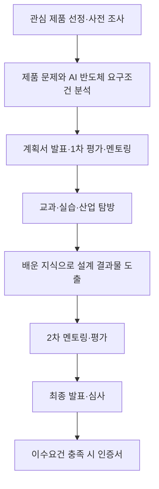
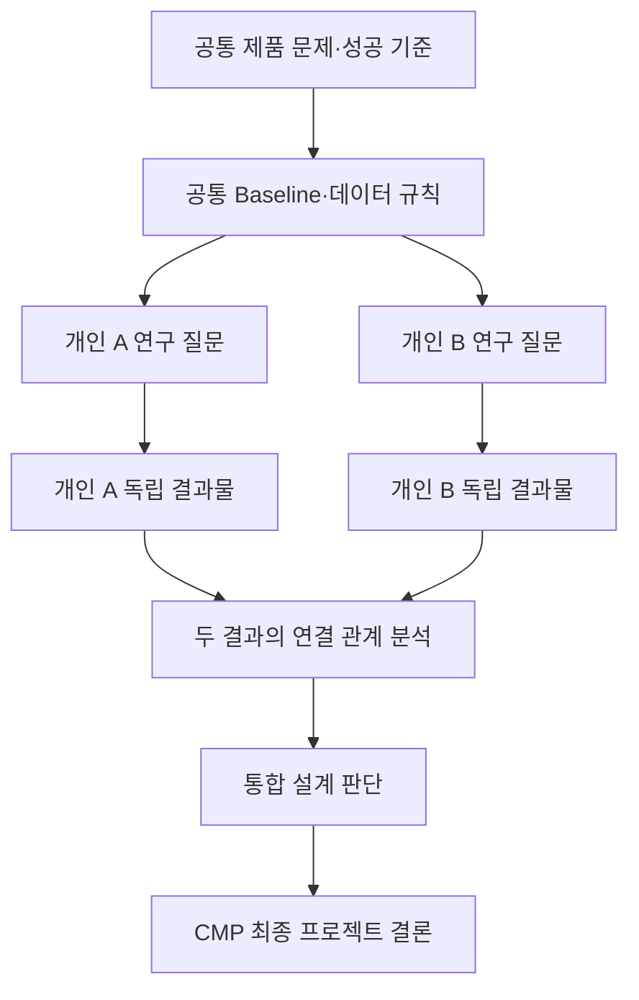

# Chips Master Program(CMP) — 소자·공정 프로젝트 분석 및 구축 가이드

> **문서 성격:** 특정 연구 주제를 정하는 문서가 아니라, 주제가 정해진 뒤 이를 CMP 요구에 맞는 소자·공정 프로젝트로 설계하기 위한 기준 문서  
> **1차 근거:** 「Chips Master Program(CMP) 설명회」, 첨단분야 혁신융합대학사업단·숭실대 차세대반도체학과, 2026.04.20.  
> **근거 표기:** 아래의 “PDF 명시사항”과 페이지 표시는 설명회 자료에 직접 나타난 내용이다. “해석”과 “권장안”은 그 내용을 프로젝트 설계 관점에서 구조화한 것이다.

---

## 1. CMP 한 줄 정의

**CMP는 AI 반도체를 사용하거나 사용할 수 있는 제품을 조사해 제품의 문제와 반도체 요구조건을 규정하고, 교과·실습·산업 탐방에서 얻은 지식을 적용하여 그 제품에 반영 가능한 설계 결과물을 만든 뒤 최종 심사로 검증받는 프로젝트형 인증 프로그램이다.** [PDF p.2]

소자·공정 분야에 적용하면, 단순히 소자 특성 그래프를 만드는 데서 끝나는 것이 아니라 **제품 문제 → 소자·공정 요구조건 → 설계·분석 결과 → 제품 관점의 의미**가 이어져야 한다.

---

## 2. CMP 프로그램 상세 설명

### 2.1 PDF 명시사항

- 참가자는 **AI 반도체를 활용하고 있거나 활용 가능한 관심 제품**을 선정하고 사전 조사한다.
- 관심 제품 선정·사전 조사에는 **2026 CES 전시를 참고**하도록 제시되어 있다.
- 사전 조사에서는 제품의 기능과 구성, AI 반도체의 용도, AI 반도체에 요구되는 조건을 분석한다.
- 교과목은 이론 습득, 비교과 강좌는 실습, 기업 견학·SEDEX·CES 탐방은 산업체의 실무 요구 파악을 담당한다.
- 배운 지식을 토대로 제품에 반영할 수 있는 **설계 결과물**을 도출한다.
- 결과물 심사와 이수요건 충족 후 인증서를 수여한다.
- 프로그램에는 멘토링, 1차 평가, 2차 멘토링 및 평가, 최종 단계의 3차 평가가 배치되어 있다. [PDF p.2]

### 2.2 해석: 프로그램의 연결 논리

CMP의 출발점은 “새로운 반도체 구조를 만들고 싶다”가 아니라 **제품 또는 응용의 문제**다. 제품을 먼저 이해해야 어떤 성능이 부족한지, 그 부족함이 AI 반도체의 어느 조건과 연결되는지, 소자·공정 설계로 개입할 수 있는지가 정해진다.

교과·비교과·산업 탐방은 서로 대체 관계가 아니다.

| 구성 | PDF상 역할 | 소자·공정 프로젝트에서의 의미 |
|---|---|---|
| 프로젝트 교과목 | 이론 습득 | 소자 물리, 공정 원리, 결과 해석의 근거 형성 |
| 비교과 단기강좌 | 실습 | TCAD와 같은 도구를 실제 결과물 생산에 사용할 능력 확보 |
| 기업 견학·SEDEX·CES | 산업체 요구 파악 | 연구 지표를 제품·제조·평가 관점의 요구와 연결 |
| 멘토링·평가 | 단계별 검토 | 주제의 적합성, 계획의 실현 가능성, 결과의 완성도를 중간에 교정 |
| 최종 심사 | 결과물 판단 | 조사·교육·설계가 하나의 논리적 결과로 수렴했는지 검증 |

### 2.3 왜 단순 교육과정이 아닌가

단순 교육과정이라면 강의를 이수하고 실습을 완료하는 것으로 종료될 수 있다. 그러나 CMP는 **관심 제품 선정 → 문제 파악 → 계획서 발표 → 지원 프로그램 참여 → 설계 결과물 도출 → 최종 심사**를 요구한다. 즉, 교육은 목적이 아니라 프로젝트 결과물을 만들기 위한 수단이다.

### 2.4 운영 및 참가 구조

**PDF 명시사항** [PDF p.3]

- 운영 기간: **2026년 4월~2027년 1월**
- 모집 분야: AI 반도체 회로 설계 / AI 반도체 소자·공정
- 참가 대상:
  - 차세대반도체 혁신융합대학사업단 컨소시엄 내 대학 재학생으로서 2026년 1·2학기 재학생
  - 차세대반도체학과 과목 1개 이상 이수자 또는 2026년 1학기 이수예정자
  - 다전공 신청자 우대
- 선발 인원: 자료에는 “00명”으로 표기되어 구체 인원 미확정
- 개인 또는 팀 참여 가능
- 팀 참여 시 **각 개인 결과물이 명확해야 하고, 이를 통합해 최종 결과물을 완성해야 하며, 계획서에 개인별 결과물을 명시해야 한다.**

회로 설계는 별도 모집 분야로 존재하지만, 이 문서는 소자·공정 분야만 상세 분석한다.

---

## 3. CMP 전체 운영 구조

### 3.1 CMP 전체 프로젝트 진행 Flow

> **해석:** 위 도식은 PDF p.2와 p.4에 흩어진 절차를 하나의 프로젝트 생애주기로 재구성한 것이다. 멘토링의 정확한 횟수나 세부 운영 방식은 PDF에 모두 확정되어 있지 않다.

### 3.2 단계별 핵심 판단

| 단계 | 반드시 답해야 하는 질문 | 다음 단계로 넘겨야 할 산출물 |
|---|---|---|
| 관심 제품 조사 | 제품에서 AI 반도체가 무슨 역할을 하는가? | 제품 기능·구성·AI 반도체 역할 정리 |
| 문제 분석 | 제품 수준의 문제가 어떤 반도체 조건과 연결되는가? | 문제 정의와 요구조건 |
| 계획서·1차 평가 | 기간 안에 무엇을 어떤 근거로 검증할 것인가? | 연구 질문, 범위, 개인별 결과물, 통합 논리 |
| 교육·실습 | 결과물을 만들기 위해 어떤 지식·도구가 부족한가? | 필요한 역량 확보와 파일럿 결과 |
| 개별 연구 | 각 팀원이 독립적으로 무엇을 입증하는가? | 개인별 데이터·해석·결론 |
| 통합 | 두 결과가 어떤 인과관계나 설계 판단으로 합쳐지는가? | 공통 결론 또는 통합 설계 |
| 최종 심사 | 문제에서 결론까지 근거가 끊기지 않는가? | 발표 가능한 증거 묶음과 한계 정리 |

---

## 4. AI 반도체 소자·공정 분야 분석

### 4.1 PDF에 제시된 교육·실습 구성

| 항목 | PDF 내용 | 시간 | 프로젝트 관점의 해석 |
|---|---|---:|---|
| 최근 소자 문제점 | Short Channel Effect | 6시간 | 미세화에서 생기는 물리적 문제를 “성능 수치”가 아니라 원인과 결과로 설명하는 훈련 |
| Process Integration | DRAM 공정 예제 | 6시간 | 개별 공정 하나가 아니라 공정 순서, 상호의존성, 열·재료·형상 변화의 누적 효과를 보는 훈련 |
| TCAD 소개 및 예제 | SProcess & SDevice | 6시간 | 공정 조건에서 구조를 만들고, 그 구조에서 전기적 동작을 계산하는 연결 도구 학습 |
| 실습 과제 | 30~40 nm 소자 제작 with TCAD | 12시간 | TCAD로 구조 생성과 소자 해석을 실제 수행해 결과물을 만드는 실습 | 

위 표는 PDF p.6의 공식 내용이다.

### 4.2 핵심 용어가 시사하는 기대 사고방식

| 용어 | 짧은 의미 | CMP 참가자에게 기대되는 관점 |
|---|---|---|
| Short Channel Effect | 채널이 짧아질 때 게이트의 전기적 제어력이 약해져 나타나는 여러 비이상 현상 | “치수가 작아졌다”에서 멈추지 않고, 구조 변화가 내부 전위·전계와 전기적 지표에 미치는 원인을 설명해야 함 |
| Process Integration | 여러 단위공정을 목표 구조와 성능에 맞게 순서·조건·호환성 관점에서 통합하는 일 | 한 공정 조건만 최적화하지 말고 앞뒤 공정, 형상, 재료, 변동성, 제조 가능성을 함께 봐야 함 |
| DRAM 공정 예제 | 공정 통합을 설명하기 위한 메모리 공정 사례 | 복잡한 제품을 공정 모듈과 소자 요구조건으로 분해하고 다시 연결하는 사고를 익히는 예제 |
| TCAD | 공정과 소자 동작을 수치적으로 모사하는 도구군 | 결과 그래프 생산 도구가 아니라 가정·모델·구조·물리·성능의 인과관계를 시험하는 도구 |
| SProcess | 공정 단계에 따른 구조·도핑·재료 변화를 모사하는 TCAD 도구 | “공정 조건 → 실제 구조·분포”의 연결을 담당 |
| SDevice | 만들어진 구조에서 전기적·물리적 동작을 계산하는 TCAD 도구 | “구조·재료 → 내부 물리 → 전기적 특성”의 연결을 담당 |
| 30~40 nm 소자 제작 실습 | PDF가 제시한 12시간 TCAD 실습 과제 | 실제 웨이퍼 제작을 뜻한다고 단정할 수 없으며, PDF 문구상 **TCAD 기반 가상 제작·해석 실습**으로 읽는 것이 타당 |
| 소자·공정 설계 | 무엇을 만들고 어떤 공정으로 만들지 정하는 단계 | 목표 구조, 성능, 공정 흐름과 평가 기준을 선행 정의해야 함 |
| Runsheet / PRP | PDF에서 “어떤 공정으로 만들 것인가?”에 대응하는 공정 계획 문서 | 공정 순서·조건·관리 항목을 재현 가능하게 기록하는 설계 산출물로 활용 가능. **PRP의 정확한 영문 풀이는 PDF에 제시되지 않음** |
| Mask | 설계 정보를 웨이퍼 패터닝에 전달하는 마스크 제작 단계 | 소자 설계와 공정 설계가 실제 제조 입력으로 합쳐지는 접점 |
| FAB | Photo, Etch, Cleaning & CMP, CVD, Diffusion & Implant, 금속 배선 등의 단위공정으로 칩을 제조하는 단계 | 연구에서 제안한 구조가 공정 순서로 구현 가능한지 검토해야 함 |
| E.T / EDS | PDF상 웨이퍼 수준 소자 평가와 칩 동작 확인 단계 | 구조 생성만으로 완료하지 말고 측정 가능한 전기 지표와 합격 기준을 미리 정해야 함. **약어의 풀이는 PDF에 없음** |
| Package / Test | 패키지 조립과 평가 시험 | 소자 성능이 후단 조건과 제품 사용 환경에서 어떤 의미를 갖는지 고려 |
| Reliability / Qual | 신뢰성 평가 단계. PDF는 이 칸을 “신뢰성 평가(10년 보증)”로 표기 | 초기 성능의 최대값뿐 아니라 열화, 변동성, 수명 관련 위험을 최종 판단에 포함. **10년은 제조 Flow 설명의 보증 관점 표기이며 학생 프로젝트의 시험 기간 요건으로 제시된 것이 아님** |

> **주의:** PDF의 마스크 단계에는 “Main Chip & TEG & SL 포함”이라고 적혀 있지만 TEG와 SL의 풀이는 제공되지 않는다. 또한 “FINFET/Planar 20 nm”는 제조 흐름 도식의 소자·공정 설계 예시이고, “30~40 nm”는 TCAD 실습 과제의 표기다. 두 수치를 모든 개인 프로젝트에 적용되는 공식 고정 조건으로 해석해서는 안 된다.

### 4.3 제조 Flow의 프로젝트 기획상 의미

PDF는 다음 흐름을 제시한다. [PDF p.6]

**소자·공정 설계 → Mask 제작 → FAB 제조 → E.T & EDS 평가 → PKG & TEST → Qual**

이 흐름이 곧 학생이 모든 제조 단계를 직접 수행해야 한다는 뜻은 아니다. PDF가 실제 학생 프로젝트의 FAB 투입이나 패키징 수행을 의무화한다고 명시하지도 않는다. 다만 이 흐름은 프로젝트를 평가하는 **전주기 질문 체계**가 된다.

1. **설계:** 무엇을 왜 만들며 어떤 공정으로 구현할 것인가?
2. **제조 입력:** 구조와 공정 계획이 마스크·공정 정보로 정의 가능한가?
3. **FAB 가능성:** 제안한 구조가 공정 순서와 물리적 제약을 견딜 수 있는가?
4. **전기 평가:** 어떤 측정값으로 성공과 실패를 판정할 것인가?
5. **제품 평가:** 칩·패키지 수준에서 어떤 이익과 부담이 생기는가?
6. **신뢰성:** 초기 성능 이외의 장기 위험은 무엇인가?

따라서 CMP 소자·공정 프로젝트의 결과는 “최적 조건 하나”보다 **설계 의도, 구현 경로, 평가 지표, 제품 의미, 한계**를 연결해 보여주는 형태가 적합하다.

---

## 5. 소자·공정 프로젝트가 갖춰야 할 구조

### 5.1 PDF에서 직접 요구되는 뼈대

1. AI 반도체를 활용하거나 활용 가능한 관심 제품을 조사한다.
2. 제품의 문제점을 파악한다.
3. 교과·비교과에서 배운 지식을 적용한다.
4. 제품에 반영 가능한 설계 결과물을 도출한다.
5. 팀이라면 각 개인 결과물을 명확히 만들고 계획서에 명시한다.
6. 개인 결과물을 통합해 하나의 최종 결과물을 완성한다.
7. 최종 발표·심사를 통과한다. [PDF p.2~4]

### 5.2 권장 프로젝트 논리

**제품 문제**  
→ **반도체 수준 요구조건**  
→ **소자·공정 문제 정의**  
→ **공통 Baseline**  
→ **변수·고정 조건·평가 지표**  
→ **개인별 연구 질문과 결과**  
→ **공정-구조-물리-전기 인과관계 통합**  
→ **제품에 반영 가능한 설계 판단**

이 구조에서 “제품”은 장식적인 배경 설명이 아니다. 연구 지표를 선택하고 최종 결과의 유용성을 판단하는 기준이다. 반대로 제품 문제를 곧바로 소자 구조 변경으로 연결하면 중간 인과관계가 비어 있으므로, 반드시 **제품 요구조건을 반도체·소자 지표로 번역하는 단계**가 필요하다.

---

## 6. 연구 주제 선정 후 권장 Workflow

아래 Framework는 특정 소자나 공정 조건을 정하지 않는다. 어떤 주제가 선택되더라도 계획서 단계에서 동일하게 적용할 수 있는 범용 절차다.

| 단계 | 결정할 것 | 다음 단계로 넘어가기 위한 결과물 | 잘못 구성했을 때의 문제 |
|---|---|---|---|
| 1. 대상 기술·제품 이해 | 제품 기능, 사용 환경, AI 반도체의 역할, 이해관계자 요구 | **제품-반도체 역할 지도** | 제품 소개와 소자 연구가 서로 무관해짐 |
| 2. 문제 정의 | 현재 상태에서 부족한 성능·제조성·신뢰성·비용 요인과 그 근거 | **한 문장 문제 정의 + 문제 발생 조건** | “성능 향상”처럼 성공 여부를 판단할 수 없는 목표가 됨 |
| 3. 연구 질문 설정 | 기간 안에 비교·반증 가능한 하나의 핵심 질문 | **독립변수, 관찰대상, 비교대상, 기대 판단이 포함된 질문** | 변수와 결과를 많이 만들지만 어떤 질문에 답했는지 불명확 |
| 4. Baseline 정의 | 변경 전 구조·공정 순서·재료·모델·바이어스·평가법 | **재현 가능한 기준 입력과 기준 성능표** | 개선율과 원인을 계산할 기준이 사라짐 |
| 5. 변수와 고정 조건 분리 | 무엇을 바꾸고 무엇을 동일하게 둘지, 변수 범위의 근거 | **변수표·고정조건표·실험/시뮬레이션 매트릭스** | 여러 요소가 동시에 바뀌어 인과 해석 불가 |
| 6. 소자·공정 관점 분리 | 공정 쪽 원인과 소자 쪽 반응을 어떤 인터페이스로 연결할지 | **공정 출력→소자 입력 대응표** | 두 연구가 병렬 보고서로만 남음 |
| 7. 개인별 연구 수행 | 각자의 독립 연구 질문, 방법, 판정 기준, 책임 데이터 | **개인별 방법·데이터·해석·소결론** | 기여도 평가 불가 또는 한 명이 다른 한 명의 보조 역할로 축소 |
| 8. 결과 연결 | 공정 변화가 구조·재료와 내부 물리를 거쳐 전기 특성에 미치는 경로 | **인과관계 표와 공통 데이터셋** | 상관관계를 원인으로 오해하거나 결과를 단순 병합 |
| 9. 검증 | Baseline, 문헌, 물리 법칙, 수치 안정성, 재현성, 한계 | **검증 기록과 반례·오차 분석** | 시뮬레이터 출력 자체를 사실로 간주 |
| 10. 통합 결과 | 두 결과를 함께 고려할 때 내릴 수 있는 설계 판단 | **통합 결론, 적용 조건, trade-off, 한계** | 개인 결과를 한 파일에 붙였을 뿐 새로운 결론이 없음 |

### 6.1 단계 통과 Gate

각 단계는 “자료를 어느 정도 모았다”가 아니라 아래 질문에 **예**라고 답할 때 통과한다.

1. 제품의 문제가 반도체 요구조건으로 번역되었는가?
2. 연구 질문은 비교 결과로 답할 수 있는가?
3. Baseline을 다른 사람이 다시 만들 수 있는가?
4. 변수 외의 조건이 무엇인지 명시했는가?
5. A와 B의 결과가 연결되는 데이터 항목이 정해졌는가?
6. 각 개인이 독립적으로 방법과 결론을 설명할 수 있는가?
7. 통합 결과가 개인 결과의 단순 합보다 추가 정보를 주는가?
8. 결론의 유효 범위와 미검증 영역이 분리되어 있는가?

### 6.2 계획서 단계에서 늦추면 위험한 결정

**계획서에 미리 고정해야 할 것**

- 공통 문제와 제품 연결
- 공통 Baseline과 비교 기준
- 핵심 연구 질문
- 개인 A/B의 결과물 정의
- 공정 결과와 소자 결과의 전달 변수
- 주요 독립변수·고정조건·정량 지표
- 데이터 형식, 단위, 명명 규칙
- 검증 방법과 실패 판정 기준
- 필요한 교과·단기강좌·도구 역량

**후반에 조정해도 되는 것**

- 발표 슬라이드의 시각 스타일
- 보조 그래프의 배치
- 결론을 뒷받침하는 추가 시각화
- 보고서 내 설명 순서의 세부 조정

핵심 조건을 후반에 바꾸면 Baseline과 개인별 데이터가 호환되지 않아 통합 자체가 무너질 수 있다.

---

## 7. 2인 팀 개인 결과물 및 통합 결과물 구조

### 7.1 2인 팀 Flow

### 7.2 세 종류 결과물의 구분

#### 개인 결과물 A

- A가 소유한 독립 연구 질문
- A가 책임지는 입력·방법·데이터
- A만의 정량 결과와 물리적 해석
- A의 질문에 대한 소결론과 한계
- B 결과 없이도 **A가 무엇을 밝혔는지** 설명 가능

#### 개인 결과물 B

- B가 소유한 독립 연구 질문
- B가 책임지는 입력·방법·데이터
- B만의 정량 결과와 공정·구조 해석
- B의 질문에 대한 소결론과 한계
- A 결과 없이도 **B가 무엇을 밝혔는지** 설명 가능

#### 통합 결과물

- A와 B의 공통 Baseline을 유지한다.
- B의 공정 결과가 만든 구조·재료 변화와 A의 소자 성능 결과를 동일 조건 또는 명시된 변환 규칙으로 연결한다.
- 두 결과가 충돌할 경우 우선순위와 trade-off를 분석한다.
- “A 결과 + B 결과”가 아니라, **두 결과를 함께 보아야만 가능한 설계 선택·적용 조건·한계**를 제시한다.

### 7.3 권장 역할 분담 원칙

“A=소자, B=공정”은 가능한 큰 틀일 뿐 충분한 역할 정의가 아니다. 다음 네 층까지 내려가야 한다.

| 구분 | 개인 A | 개인 B | 공동 |
|---|---|---|---|
| 연구 질문 | 구조·재료 변화가 내부 물리와 전기 성능에 미치는 영향 | 공정 조건이 목표 구조·재료 특성과 제조 가능성에 미치는 영향 | 제품 문제와 최종 성공 기준 |
| 책임 데이터 | 내부 물리량, 전기 특성, 성능 지표 | 공정 프로파일, 형상·재료·분포, 공정 window | Baseline, 단위, 조건 ID |
| 독립 결론 | 어떤 구조·물리 변화가 성능을 지배하는가 | 어떤 공정 경로가 그 구조를 만들며 어떤 제약이 있는가 | 어느 조합이 제품 요구를 가장 잘 만족하는가 |
| 통합 기여 | 공정 결과의 전기적 의미를 판정 | 소자 요구의 공정 실현 가능성을 판정 | 설계 선택과 적용 한계 |

이 표는 **권장 역할 구조**이며 CMP의 공식 역할 지정은 아니다.

### 7.4 좋은 분담과 좋지 않은 분담

| 좋은 분담 | 좋지 않은 분담 |
|---|---|
| 공통 문제와 Baseline을 공유하되 연구 질문은 구분됨 | 서로 다른 제품·소자를 다뤄 공통 결론이 없음 |
| 각자 방법·데이터·해석·결론을 소유함 | 한 명은 시뮬레이션, 다른 한 명은 PPT·자료정리만 담당 |
| A 출력이 B의 입력·제약 또는 해석 근거가 됨 | 두 결과를 보고서 앞뒤에 배치하는 것만으로 통합이라 주장 |
| 통합 기준이 계획서에 미리 적혀 있음 | 연구가 끝난 뒤 억지로 공통 제목만 붙임 |
| 병렬 수행이 가능하면서 정해진 시점에 결과를 연결함 | B가 A의 최종 완료까지 아무 작업도 할 수 없는 완전 직렬 구조 |
| 동일 지표를 사용해도 서로 다른 질문과 기여가 분명함 | 변수 범위만 반으로 나눠 같은 작업을 반복 |

---

## 8. 소자 연구와 공정 연구의 연결 방법

### 8.1 핵심 인과 Chain

**공정 조건**  
→ **물리적 구조·재료 특성 변화**  
→ **소자 내부 물리 변화**  
→ **전기적 특성 변화**  
→ **제품·응용 관점의 의미**

| 연결 층 | 확인할 질문 | 필요한 증거 | 다음 팀원에게 전달할 정보 |
|---|---|---|---|
| 공정 조건 | 무엇을 어떤 순서와 조건으로 바꾸었는가? | Runsheet/조건표/공정 시뮬레이션 설정 | 조건 ID와 공정 이력 |
| 구조·재료 | 실제로 어떤 치수·형상·분포·계면이 달라졌는가? | 구조 단면, 프로파일, 정량 측정값 | 소자 해석에 사용할 구조 파일과 특징값 |
| 내부 물리 | 전위·전계·전하·전류 경로 등 무엇이 달라졌는가? | 공간 분포와 물리적 설명 | 전기 지표 변화의 원인 |
| 전기 특성 | 어떤 특성 곡선과 정량 지표가 변했는가? | 공통 추출 규칙을 적용한 비교표 | 성공 기준 충족 여부 |
| 제품 의미 | 이 변화가 제품 요구조건에 어떤 이익·비용·위험을 주는가? | 요구조건 대비표, trade-off | 최종 설계 판단 |

### 8.2 연결을 실제로 작동시키는 공통 인터페이스

두 팀원은 최소한 다음을 공동 규격으로 정해야 한다.

- 동일한 Baseline 버전과 조건 ID
- 구조·재료·공정 변수의 이름, 단위, 좌표 기준
- 전기 특성 추출법과 측정 조건
- 공정 결과가 소자 입력으로 전달되는 형식
- 실패·비수렴·이상값 처리 규칙
- 결과 갱신 시 버전 기록
- 개인 결과를 통합 판단으로 바꾸는 의사결정 규칙

핵심은 **공정팀의 결론이 “구조가 이렇게 변했다”에서 끝나지 않고, 소자팀의 결론도 “전기 특성이 좋아졌다”에서 끝나지 않게 하는 것**이다. 두 결론 사이의 중간 물리와 전달 변수를 기록해야 하나의 연구 chain이 된다.

---

## 9. 연구 범위 및 변수 설정 원칙

### 9.1 좋은 연구 질문의 범위

좋은 질문은 다음 요소를 포함한다.

- 한정된 대상과 동작 조건
- 명확한 Baseline과 비교 변경
- 통제 가능한 독립변수
- 정량적으로 관찰할 결과
- 결과를 설명할 물리·공정 가설
- 기간 안에 생성·검증 가능한 데이터
- 제품 요구조건과의 연결

반대로 너무 넓은 질문은 “전반적 성능 개선”, “모든 공정 최적화”, “소자 제작부터 패키지·신뢰성까지 완성”처럼 성공 조건이 모호하거나 서로 다른 연구 문제를 한 문장에 묶는다.

### 9.2 변수 제한 방법

**권장안**

1. 먼저 핵심 가설 하나를 정한다.
2. 그 가설을 직접 시험하는 **최소한의 변수군**만 1차 연구에 둔다.
3. 다른 치수·재료·모델·바이어스는 고정조건표에 기록한다.
4. 변수 간 상호작용 자체가 연구 질문일 때만 다변수 조합을 추가한다.
5. 넓은 탐색보다 원인 설명이 가능한 조밀한 비교를 우선한다.
6. 추가 변수는 “핵심 결론을 바꿀 가능성”과 “검증 비용”으로 우선순위를 정한다.

### 9.3 Baseline과 비교군

Baseline은 개선율 계산용 기준일 뿐 아니라 **원인의 격리, 재현성 확인, 팀 간 호환성**을 위한 공통 좌표다.

권장 비교 구조는 다음과 같다.

- **Baseline:** 변경 전 기준
- **단일 변경군:** 핵심 변수만 변경
- **필요 시 상호작용군:** 두 변화의 결합 효과가 질문에 포함될 때
- **검증용 기준:** 문헌·공개 데이터·이론적 경향 등과 비교 가능한 조건

비교군은 개수가 많다고 좋은 것이 아니라 각 군이 어떤 가설을 판별하는지 설명할 수 있어야 한다.

### 9.4 정량 지표 선정

지표는 가능한 한 세 층을 연결한다.

1. **공정·구조 지표:** 형상, 분포, 재료 특성, 공정 허용범위
2. **소자·전기 지표:** 특성 곡선에서 정의된 성능·누설·제어·안정성 지표
3. **제품 지표 또는 대리 지표:** 속도, 전력, 정확성 유지, 수명, 제조성 등 제품 요구와 연결되는 값

각 지표에는 정의, 단위, 추출 조건, 계산식, 데이터 출처가 있어야 한다. 지표를 많이 모으는 것보다 **연구 질문을 판정하는 핵심 지표와 부작용을 감시하는 보조 지표**를 구분하는 것이 중요하다.

### 9.5 TCAD 범위 설정

TCAD에서는 최소한 다음을 확인해야 한다.

- 구조·재료·도핑·공정 조건이 의도대로 반영되었는가?
- 사용한 물리 모델과 경계·바이어스 조건이 질문에 적합한가?
- mesh와 solver 설정 변화에도 핵심 결론이 유지되는가?
- Baseline과 변경군을 동일한 추출 규칙으로 비교했는가?
- 결과의 방향을 내부 물리로 설명할 수 있는가?
- 비수렴·이상값·실패 실행을 임의로 제외하지 않았는가?
- 다른 사람이 입력, 버전, 조건표로 결과를 재현할 수 있는가?

### 9.6 결과 해석과 단순 최적화의 차이

- **단순 최적화:** 여러 조건을 실행해 가장 큰 성능값을 선택한다.
- **연구 해석:** 왜 그 조건에서 결과가 달라졌는지, 어떤 trade-off가 생겼는지, 어느 범위까지 결론이 유효한지 설명한다.

CMP의 제품 문제-설계 결과 연결을 충족하려면 두 번째가 필요하다. 최고값 하나만으로는 제조 가능성, 다른 성능의 악화, 모델 의존성, 제품 적용 조건을 판단할 수 없다.

### 9.7 모든 제조 단계를 직접 수행하지 않아야 하는 이유

PDF의 제조 Flow는 FAB가 700~1000 step 규모임을 예시한다. [PDF p.6] 학생 프로젝트 기간에 설계부터 마스크, 전체 FAB, 웨이퍼 평가, 패키지, 신뢰성까지 모두 직접 완성하려 하면 각 단계가 피상적이 된다.

**권장안:** 핵심 연구 질문은 소자·공정 설계와 검증 가능한 범위에 집중하고, Mask·FAB·E.T/EDS·Package/Test·Qual은 다음 중 하나로 연결한다.

- 구현 가능성 검토
- 필요한 입력·출력 정의
- 예상되는 평가 방법
- 후속 실험·제조 계획
- 현재 결과로 말할 수 없는 한계

---

## 10. 결과 검증 전략

### 10.1 다층 검증

| 검증 층 | 검증 내용 | 통과의 의미 |
|---|---|---|
| 입력 검증 | 구조, 공정 순서, 재료, 단위, 조건, 버전 확인 | 의도한 실험이 실제로 실행됨 |
| 수치 검증 | mesh 민감도, solver 수렴, 반복 실행, 추출 코드 확인 | 수치 설정 때문에 생긴 가짜 경향 가능성 감소 |
| 물리 검증 | 내부 물리량과 전기 결과의 방향·원인 일치 | 결과가 설명 가능한 물리 chain을 가짐 |
| Baseline 검증 | 기준 구조의 동작과 지표가 합리적이며 재현됨 | 개선 비교의 출발점이 유효 |
| 외부 근거 검증 | 문헌·공개 실험·이론적 경향과 비교 | 시뮬레이션이 현실과 완전히 분리되지 않음 |
| 공정 검증 | 목표 구조가 공정 흐름과 허용범위에서 가능한지 검토 | 전기적으로 좋은 구조가 제조 불가능한 오류 방지 |
| 통합 검증 | 공정 출력과 소자 입력이 동일 조건·단위·버전인지 확인 | 두 개인 결과를 인과적으로 결합 가능 |
| 제품 검증 | 개선된 지표가 최초 제품 요구조건에 의미가 있는지 확인 | 프로젝트가 제품 문제에 답함 |

### 10.2 Baseline 비교 원칙

- 변경군과 같은 모델·바이어스·추출법을 사용한다.
- 개선율뿐 아니라 절대값을 함께 제시한다.
- 핵심 지표 개선과 함께 악화된 보조 지표도 공개한다.
- 실패·비수렴 조건을 별도 결과로 기록한다.
- 결과가 유지되는 유효 범위와 유지되지 않는 범위를 구분한다.

### 10.3 문헌 및 실험 비교 원칙

문헌값과 직접 일치시키기보다 먼저 구조, 공정, 온도, 바이어스, 지표 정의가 같은지 확인한다. 조건이 다르면 정량 일치보다 **경향 비교**로 제한한다. 실제 데이터에 맞춰 모델을 보정하지 않았다면 “calibrated”, “fabrication-accurate”와 같은 표현을 사용하지 않는다.

### 10.4 재현성 기록

권장 최소 기록:

- 입력 파일과 해시 또는 버전
- 도구·모델·주요 설정
- 조건표와 실행 ID
- 원시 결과와 지표 추출 규칙
- 실패 로그
- 분석 스크립트 또는 계산식
- 그래프가 참조한 원시 데이터
- 결과를 만든 사람과 갱신 일자

---

## 11. 예상 결과물 구조

### 11.1 PDF가 직접 요구하는 결과

- 제품에 반영 가능한 설계 결과물
- 팀 참여 시 개인별로 명확한 결과물
- 개인 결과물의 통합으로 완성되는 최종 결과물
- 계획서에 명시된 개인별 결과물
- 최종 발표·심사를 위한 프로젝트 결과 [PDF p.2~4]

PDF는 소자·공정 분야의 최종 제출 파일 형식이나 보고서 목차를 구체적으로 규정하지 않는다.

### 11.2 권장 결과물 묶음

| 수준 | 포함 내용 | 완료 판정 |
|---|---|---|
| 개인 결과물 A | 질문, 가설, 방법, 책임 입력, 원시·가공 데이터, 정량 지표, 물리 해석, 소결론, 한계 | A의 기여와 결론을 독립적으로 평가 가능 |
| 개인 결과물 B | 질문, 가설, 방법, 책임 입력, 공정·구조 데이터, 정량 지표, 공정 해석, 소결론, 한계 | B의 기여와 결론을 독립적으로 평가 가능 |
| 팀 통합 결과물 | 공통 Baseline, 공정-구조-물리-전기 연결, trade-off, 통합 설계 판단, 적용 조건 | A+B를 함께 보아야 나오는 새로운 결론 존재 |
| CMP 제출 결과물 | 제품 조사, 문제 정의, 교육·탐방 반영, 계획 대비 수행, 개인 기여, 통합 결과, 검증, 한계, 최종 발표 자료 | 최초 제품 문제부터 최종 설계 결과까지 추적 가능 |

### 11.3 권장 CMP 제출 패키지

1. 최종 보고서
2. 발표자료
3. 개인 A 결과 요약서
4. 개인 B 결과 요약서
5. 공통 Baseline 및 조건표
6. 원시 데이터와 가공 데이터
7. 재현 가능한 입력·스크립트·실행 기록
8. 검증 및 오류·한계 기록
9. 통합 설계 판단표

이는 재사용성과 심사 대응력을 높이기 위한 **권장안**이며 PDF의 공식 파일 목록은 아니다.

---

## 12. CMP 공식 일정

### 12.1 공식 일정표

| 순서 | 일정 | PDF 명시 날짜 | 주요 내용·조건 |
|---:|---|---|---|
| 1 | 참가 신청 | **~2026.04.27** | 구글폼 신청 |
| 2 | 본신청 | **~2026.05.05** | 필수서류 제출 |
| 3 | 1차 발표 평가 | **2026년 6월 첫째 주까지 수시 진행** | 지원 분야별 발표 |
| 4 | 프로젝트 계획서 발표 및 멘토링 | **1차 발표 평가와 함께 진행** | 계획서 기반 발표·멘토링 |
| 5 | 참여자 선발 | **2026년 6월 둘째 주** | 결과물 도출에 필요한 배경지식을 갖춘 신청자에 한함. 계획서에 나타난 교과목 수강을 포함한 활동 내역으로 판단 |
| 6 | 26-2학기 필수이수 교과목 수강 | **~2027년 1월까지의 지원 프로그램 기간** | 1차 합격자에게 별도 공지. 필수 교과목은 CMP 2차 멘토링·평가 과정이며 **B- 이상**을 받은 참가자만 2차 평가 합격 |
| 7 | 하계·동계 단기강좌 | **정확한 개별 날짜 미기재, ~2027년 1월까지** | 교과목에서 다루지 않는 실습 위주. 회로 설계 분야의 별도 EDA 강좌 설명은 이 보고서의 핵심 범위에서 제외 |
| 8 | 기업 견학 | **정확한 개별 날짜 미기재, ~2027년 1월까지** | 참관 프로그램 3개 중 1개 이상 참여 필요 |
| 9 | SEDEX | **정확한 개별 날짜 미기재, ~2027년 1월까지** | 참관 프로그램 선택지 |
| 10 | CES | **정확한 개별 날짜 미기재, ~2027년 1월까지** | 참가자는 별도 과정을 거쳐 선발, 추후 공지 예정 |
| 11 | 2차 평가 | **지원 프로그램 참여 기간 중** | 필수 교과목 성적 B- 이상이 핵심 합격 조건으로 명시 |
| 12 | 최종 발표 및 심사 | **2027년 1월 말** | 최종 심사 통과 필요. PDF p.2의 구조상 최종 결과물 심사는 3차 평가에 해당 |
| 13 | 이수증 수여 | **2027년 1월 말** | 필수 교과목 수강, 참관 프로그램 1개 이상 참여, 최종 심사 통과 시 |

### 12.2 일정 해석 시 주의

- 프로그램 전체 운영 기간은 **2026년 4월~2027년 1월**이다. [PDF p.3]
- 일정표 제목은 “프로그램 일정(수정안)”이며, **일정은 변동 가능하고 자세한 내용은 폴라리스 홈페이지에서 확인**하라고 명시되어 있다. [PDF p.4]
- 하계·동계 단기강좌, 기업 견학, SEDEX, CES의 개별 날짜는 PDF에 없다.
- PDF p.2의 1차·2차·3차 평가 개념과 p.4의 일정표를 연결하면, 계획서 발표가 1차, 지원 프로그램과 필수 교과목이 2차, 최종 발표·심사가 3차 단계로 해석된다.

---

## 13. 공식 일정에 대응한 권장 연구 Timeline

아래는 공식 일정을 연구 진행 단계에 연결한 **권장안**이다. 공식 제출 마감 외의 연구 완료 시점은 PDF가 정한 의무가 아니다.

| 시기·공식 이벤트 | 권장 연구 상태 | 이 시점의 Gate |
|---|---|---|
| 4월: 프로그램 이해·참가 신청 | 관심 제품군 조사, AI 반도체 역할 파악, 문제 후보 목록 작성 | 제품과 반도체 역할이 연결되는가? |
| ~5월 5일: 본신청 | 문제 후보를 좁히고 소자·공정 관점의 개입 가능성 검토 | 단순 제품 조사에서 연구 질문으로 발전 가능한가? |
| 5월~6월 첫째 주: 계획서 발표 준비 | 공통 문제, Baseline 후보, 핵심 질문, 변수·지표, A/B 개인 결과물, 통합 원리, 필요한 교육 명시 | 계획만 읽어도 각 개인 결과와 최종 통합 결과가 구분되는가? |
| 6월 둘째 주: 참여자 선발 | 멘토링 피드백 반영, 범위 축소, 위험 요소와 대체 계획 정리 | 기간 안에 검증 가능한 최소 프로젝트가 정의되었는가? |
| 하계 단기강좌·초기 지원 기간 | TCAD·분석 역량 확보, Baseline 파일럿 실행, 추출 규칙 검증 | Baseline이 재현되고 핵심 데이터가 실제 생성되는가? |
| 2026-2학기 필수 교과목·2차 평가 | 공통 Baseline 고정, 개인 A/B 연구 병렬 수행, 정기 데이터 교환과 중간 검증 | 각 개인 결과가 독립 평가 가능하며 데이터가 서로 호환되는가? |
| 기업 견학·SEDEX·CES 중 참여 | 산업 요구를 기록하고 지표·제조성·신뢰성 판단에 반영 | 참관 내용이 프로젝트의 요구조건 또는 한계에 실제 반영되었는가? |
| 학기 후반 | 개인 결과물 1차 완성, 공정-구조-물리-전기 연결, 반례·민감도 검증 | 통합 결론이 개인 결론의 단순 병합을 넘어서는가? |
| 동계 단기강좌·1월 초 | 부족한 실습 보완, 통합 분석 확정, 재현성 패키지 정리 | 핵심 결론을 동일 입력으로 다시 만들 수 있는가? |
| 2027년 1월 말: 최종 발표·심사 | 제품 문제부터 통합 설계 판단까지 하나의 이야기로 발표, 한계와 후속 검증 구분 | 이수조건과 연구 논리를 모두 충족하는가? |

### 13.1 권장 실행 순서

**프로그램·제품 이해**  
→ **문제 후보 조사**  
→ **연구 질문 축소**  
→ **계획서와 개인별 결과물 정의**  
→ **Baseline 파일럿**  
→ **공통 조건 고정**  
→ **개인 연구 병렬 수행**  
→ **중간 검증과 데이터 교환**  
→ **개인 결과물 완성**  
→ **소자·공정 인과관계 통합**  
→ **문헌·물리·수치·재현성 검증**  
→ **최종 보고서·발표·심사**

---

## 14. CMP 프로젝트 설계 원칙 및 체크리스트

### 14.1 후보 주제 평가 체크리스트

| # | 확인 항목 | 성격 | 통과 증거 |
|---:|---|---|---|
| 1 | AI 반도체를 사용하거나 사용할 수 있는 제품·응용이 명확한가? | PDF 명시 | 제품 기능과 AI 반도체 역할 설명 |
| 2 | 제품의 구체적 문제와 반도체 요구조건이 연결되는가? | PDF 명시 | 문제-요구조건 대응표 |
| 3 | 최종 결과가 제품에 반영 가능한 설계 판단으로 표현되는가? | PDF 명시 | 적용 가능한 설계 결과와 조건 |
| 4 | 소자·공정 분야의 지식과 도구가 연구 핵심에 있는가? | PDF 명시·해석 | 소자 물리, 공정 통합 또는 TCAD의 실질적 역할 |
| 5 | 개인 A의 질문·방법·데이터·결론이 독립적으로 식별되는가? | PDF 명시 | A 결과물 정의 |
| 6 | 개인 B의 질문·방법·데이터·결론이 독립적으로 식별되는가? | PDF 명시 | B 결과물 정의 |
| 7 | 계획서에 개인별 결과물이 명시되는가? | PDF 명시 | 계획서 역할·산출물 표 |
| 8 | A와 B가 하나의 최종 결과로 통합되는가? | PDF 명시 | 연결 변수와 통합 의사결정 규칙 |
| 9 | 필수 교과목, 참관 1개 이상, 최종 심사 등 이수조건을 반영했는가? | PDF 명시 | 일정·이수 관리표 |
| 10 | 연구 질문이 기간 안에 비교·반증 가능한가? | 권장 | 한 문장 질문과 성공/실패 기준 |
| 11 | 재현 가능한 공통 Baseline이 있는가? | 권장 | 기준 입력·버전·기준 결과 |
| 12 | 독립변수와 고정조건이 분리되어 있는가? | 권장 | 변수표와 고정조건표 |
| 13 | 공정→구조·재료→내부 물리→전기→제품의 인과관계가 있는가? | 권장 | 인과 chain과 각 층의 증거 |
| 14 | 핵심 정량 지표의 정의·단위·추출법이 정해졌는가? | 권장 | 지표 사전 |
| 15 | TCAD 수치 안정성, 물리 타당성, 문헌 비교, 재현성을 검증하는가? | 권장 | 검증 계획과 결과 기록 |
| 16 | 결과의 최댓값뿐 아니라 trade-off와 실패 조건을 다루는가? | 권장 | 다중 지표 비교와 실패 로그 |
| 17 | 직접 수행할 범위와 후속 제조·평가로 남길 범위가 분리되는가? | 권장 | 범위 내/외 표 |
| 18 | 결론의 유효 범위와 아직 검증하지 못한 부분을 구분하는가? | 권장 | 한계·후속 검증 항목 |

### 14.2 내부 판단 기준

이 분류는 공식 CMP 선발 기준이 아니라 후보 비교를 위한 **권장 내부 기준**이다.

- **적합:** PDF 명시 항목을 모두 충족하며, Baseline·개인 결과·통합 인과관계·검증 계획이 구체적이다.
- **조건부 적합:** 제품 문제와 소자·공정 연결은 타당하지만 범위, Baseline, 역할 또는 검증법이 아직 불명확하다.
- **재설계 필요:** 제품 문제와 설계 결과가 연결되지 않거나, 두 개인의 기여를 구분할 수 없거나, 통합 결과가 존재하지 않는다.

### 14.3 최종 발표 전 자기검증 질문

- 우리는 어떤 제품 문제에서 시작했는가?
- 그 문제가 왜 AI 반도체 소자·공정 문제인가?
- 무엇을 Baseline으로 삼았고 왜 타당한가?
- 바꾼 것과 고정한 것은 무엇인가?
- 개인 A와 B는 각각 어떤 질문에 답했는가?
- 두 결과를 연결하는 물리적·공정적 인과관계는 무엇인가?
- 통합 후 새롭게 내린 설계 판단은 무엇인가?
- 최고 성능 조건 외에 어떤 trade-off와 실패 조건이 있는가?
- 시뮬레이션 결과가 수치 설정의 산물이 아님을 어떻게 확인했는가?
- 결과가 어느 조건까지 유효하며 무엇은 아직 주장할 수 없는가?
- 이 결과가 최초 제품 요구조건에 어떤 의미가 있는가?
- CMP 이수조건과 제출 준비가 모두 충족되었는가?

---

## 15. 핵심 결론

1. **CMP의 중심은 제품 문제에서 출발해 제품에 반영 가능한 설계 결과로 돌아오는 폐쇄형 논리다.**
2. 소자·공정 분야에서는 TCAD 결과 자체보다 **공정 조건-구조·재료-내부 물리-전기 특성-제품 의미**의 인과관계가 중요하다.
3. 2인 팀은 공통 문제와 Baseline을 공유하되, 각자 독립 연구 질문·데이터·결론을 가져야 한다.
4. 통합 결과물은 개인 결과를 합친 문서가 아니라 두 결과를 함께 고려할 때만 가능한 **새로운 설계 판단**이어야 한다.
5. 계획서 단계에서 Baseline, 변수, 지표, 개인 결과물, 연결 인터페이스, 검증법을 정해야 후반 통합 실패를 막을 수 있다.
6. 학생 프로젝트에서는 전체 제조 Flow를 모두 수행하려 하기보다 검증 가능한 핵심 범위에 집중하고, 후속 공정·평가·신뢰성 단계는 구현 가능성·평가 계획·한계로 연결하는 것이 타당하다.
7. 최종 심사에서 가장 설득력 있는 구조는 “많은 simulation”이 아니라 **명확한 질문, 통제된 비교, 재현 가능한 증거, 물리적 해석, 통합 결론, 정직한 한계**다.

---

## 부록. PDF 사실과 본 문서 권장안의 경계

### PDF가 직접 확정한 것

- 프로그램 목적과 제품 조사 출발점
- 교과·비교과·탐방·멘토링·평가 구조
- 소자·공정 실습 항목과 시간
- 제조 Process Flow
- 팀 프로젝트의 개인 결과물 및 통합 결과물 조건
- 공식 일정, 성적·참관·최종 심사 이수조건

### 본 문서가 프로젝트 설계를 위해 제안한 것

- 10단계 연구 Workflow와 단계 Gate
- 공정-소자 데이터 인터페이스
- 역할 분담 표와 좋고 나쁜 분담 기준
- 다층 검증 체계와 재현성 기록
- 공식 일정에 대응한 연구 완료 시점
- 후보 평가 체크리스트와 내부 적합성 분류

이 경계를 유지하면 이후 주제를 선정할 때 CMP의 공식 요구를 왜곡하지 않으면서도, 실제 수행 가능한 연구 계획으로 구체화할 수 있다.
